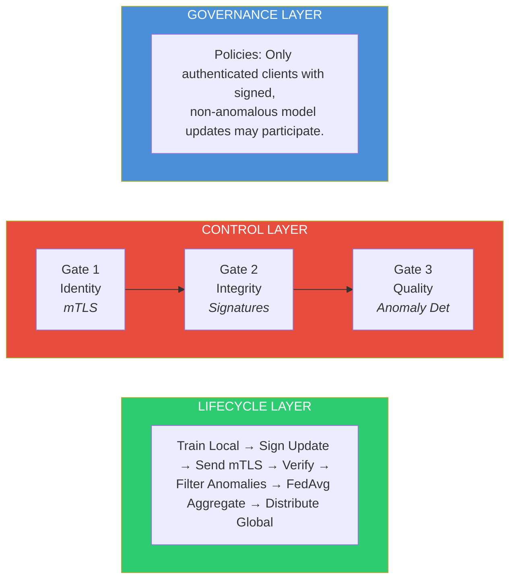
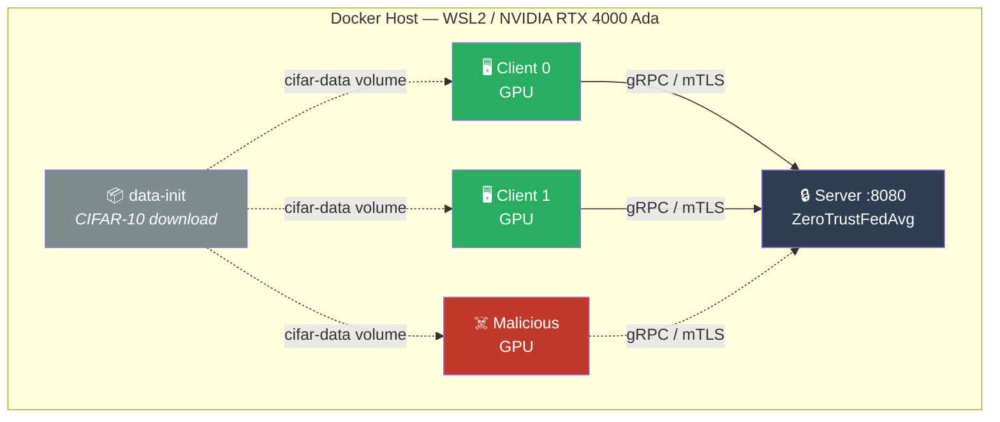
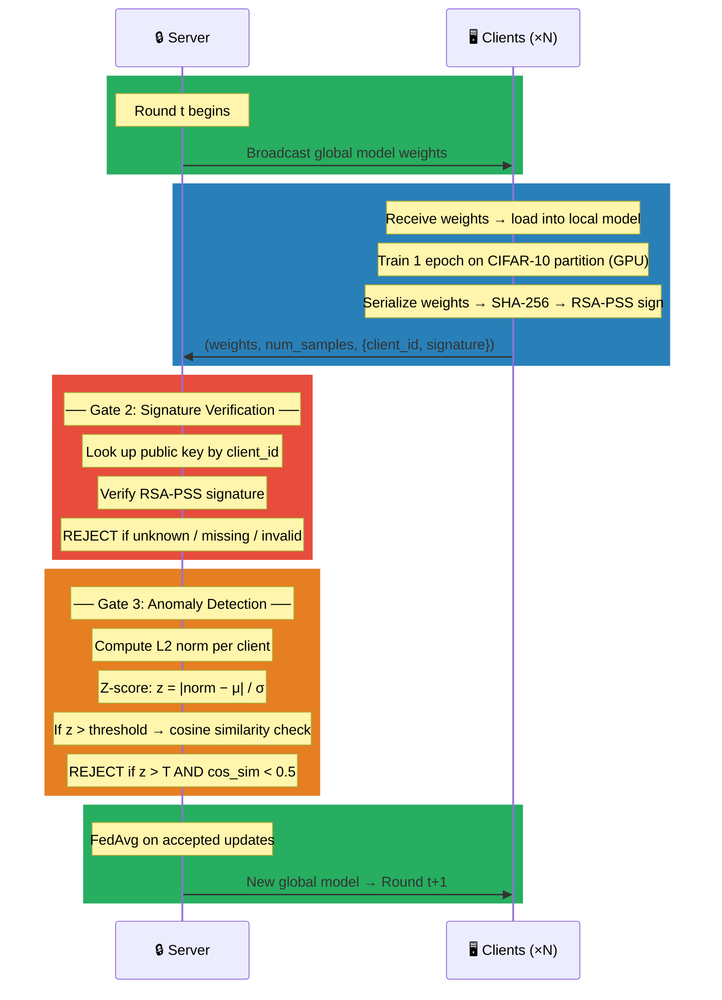
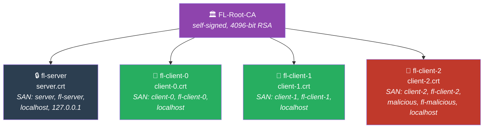
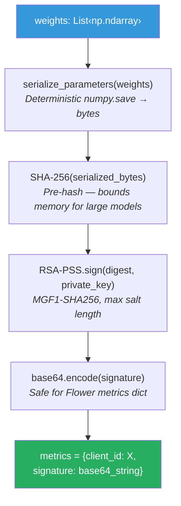
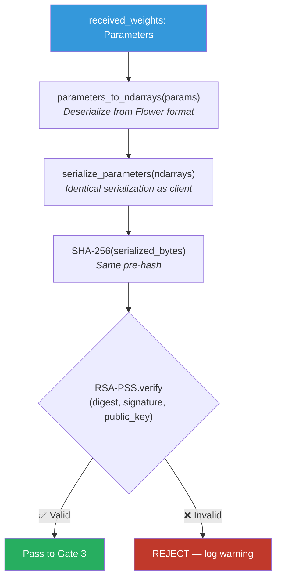
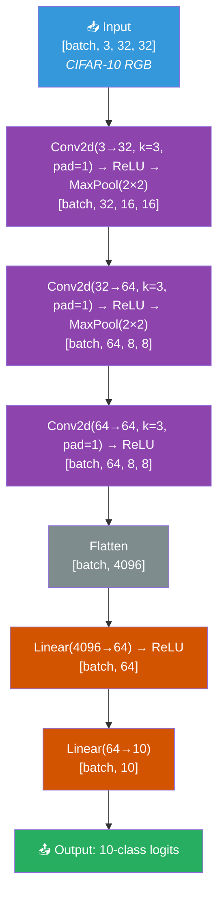
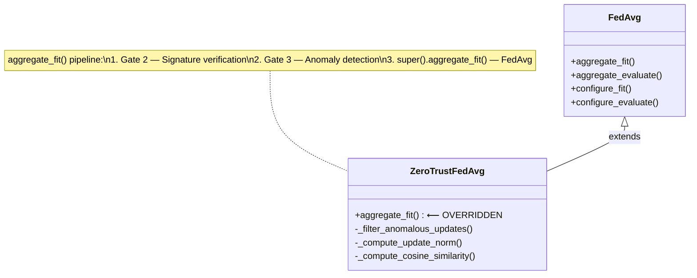

# Designing a Zero-Trust MLOps Pipeline for Secure Federated Edge Learning

> **Master's Thesis Project — Architecture Documentation**
>
> Author: _[Your Name]_ · Date: March 2026 · Version: 1.0

---

## Table of Contents

1. [Executive Summary](#1-executive-summary)
2. [Problem Statement & Motivation](#2-problem-statement--motivation)
3. [Architecture Overview](#3-architecture-overview)
   - 3.1 [The Three-Layer Model](#31-the-three-layer-model)
   - 3.2 [System Topology](#32-system-topology)
   - 3.3 [High-Level Data Flow](#33-high-level-data-flow)
4. [Technical Stack](#4-technical-stack)
5. [Project Structure](#5-project-structure)
6. [Governance Layer — Policy Definitions](#6-governance-layer--policy-definitions)
7. [Control Layer — The Zero-Trust Gates](#7-control-layer--the-zero-trust-gates)
   - 7.1 [Gate 1: Identity Verification (mTLS)](#71-gate-1-identity-verification-mtls)
   - 7.2 [Gate 2: Update Integrity (Digital Signatures)](#72-gate-2-update-integrity-digital-signatures)
   - 7.3 [Gate 3: Aggregation Quality (Anomaly Detection)](#73-gate-3-aggregation-quality-anomaly-detection)
8. [Lifecycle Layer — The Federated Learning Loop](#8-lifecycle-layer--the-federated-learning-loop)
   - 8.1 [Model Architecture](#81-model-architecture)
   - 8.2 [Data Partitioning](#82-data-partitioning)
   - 8.3 [Training Configuration](#83-training-configuration)
   - 8.4 [Aggregation Strategy](#84-aggregation-strategy)
9. [Infrastructure & Deployment](#9-infrastructure--deployment)
   - 9.1 [Docker Image](#91-docker-image)
   - 9.2 [Docker Compose Orchestration](#92-docker-compose-orchestration)
   - 9.3 [GPU Passthrough](#93-gpu-passthrough)
10. [Security Verification & Attack Simulation](#10-security-verification--attack-simulation)
    - 10.1 [Normal Operation](#101-normal-operation)
    - 10.2 [Attack Scenario — Poisoned Client](#102-attack-scenario--poisoned-client)
    - 10.3 [Attack Scenario — Swapped Signing Keys](#103-attack-scenario--swapped-signing-keys)
    - 10.4 [Attack Scenario — Missing Certificate](#104-attack-scenario--missing-certificate)
11. [Configuration Reference](#11-configuration-reference)
12. [Limitations & Future Work](#12-limitations--future-work)

---

## 1. Executive Summary

This project implements a **simulation** of a Federated Learning (FL) system secured with a **Zero-Trust Architecture**. The core principle is: _"Never trust, always verify."_ Every participant and every model update passes through three independent security gates before being accepted into the global model.

The system simulates multiple edge devices as Docker containers communicating with a central aggregation server over gRPC. An NVIDIA RTX 4000 Ada GPU is shared across all containers for accelerated local training on CIFAR-10.

**Key deliverables:**
- A working Flower-based FL pipeline with FedAvg aggregation
- Mutual TLS (mTLS) for bidirectional identity verification
- RSA-PSS digital signatures on all model updates
- Statistical anomaly detection to reject poisoned weight updates
- A malicious client simulator to demonstrate Gate 3 effectiveness

---

## 2. Problem Statement & Motivation

Federated Learning enables model training across distributed edge devices without centralizing raw data. However, this architecture introduces unique attack surfaces:

| Threat | Description | Impact |
|--------|-------------|--------|
| **Sybil Attack** | An attacker registers fake clients to outvote honest ones | Model convergence on attacker's objective |
| **Man-in-the-Middle** | Intercepting gRPC traffic between client and server | Weight exfiltration, gradient manipulation |
| **Model Poisoning** | Legitimate client sends crafted malicious updates | Backdoor injection, accuracy degradation |
| **Free-Riding** | Client sends random weights without training | Wastes aggregation budget, reduces model quality |

Traditional FL assumes a trusted communication channel and honest-but-curious participants. A Zero-Trust approach treats **every client as potentially compromised** and verifies each interaction independently.

---

## 3. Architecture Overview

### 3.1 The Three-Layer Model



| Layer | Responsibility | Implementation |
|-------|---------------|----------------|
| **Governance** | Define participation rules and security policies | Encoded in strategy configuration and environment variables |
| **Control** | Enforce the policies through three sequential gates | `ZeroTrustFedAvg` strategy class in `server.py` |
| **Lifecycle** | Execute the FL training loop | Flower framework (`flwr`) client/server protocol |

### 3.2 System Topology



### 3.3 High-Level Data Flow

A single FL round proceeds as follows:



> **Note:** Gate 1 (mTLS) operates at the transport layer. Any client without a valid CA-signed certificate is rejected during the TLS handshake, _before_ any application-level data is exchanged.

---

## 4. Technical Stack

| Component | Technology | Version | Purpose |
|-----------|-----------|---------|---------|
| OS | Windows 11 + WSL2 (Ubuntu 22.04) | — | Development environment |
| GPU | NVIDIA RTX 4000 Ada | — | Accelerated local training |
| Container Runtime | Docker + NVIDIA Container Toolkit | — | Simulate edge devices |
| FL Framework | Flower (`flwr`) | 1.13.1 | Client-server FL protocol, strategy customization |
| ML Framework | PyTorch | 2.5.1 (CUDA 12.4) | CNN model definition and training |
| Dataset | CIFAR-10 (via `torchvision`) | 0.20.1 | 60K 32×32 colour images, 10 classes |
| TLS Certificates | OpenSSL | System | PKI: Root CA, server cert, per-client certs |
| Digital Signatures | `cryptography` (Python) | ≥42.0.0 | RSA-PSS signing/verification with SHA-256 |
| gRPC | `grpcio` | ≥1.62.0 | Transport layer (Flower's communication backend) |
| Orchestration | Docker Compose | v2 | Multi-container service definition |

---

## 5. Project Structure

```
ZT-Pipeline/
│
├── model.py                  # CifarCNN – shared model definition
├── server.py                 # Flower server + ZeroTrustFedAvg strategy
├── client.py                 # Honest Flower client (train + sign + send)
├── poisoned_client.py        # Malicious client for attack simulation
├── signing.py                # RSA-PSS sign/verify utilities
│
├── generate_certs.sh         # OpenSSL PKI generation (mTLS certs)
├── generate_signing_keys.sh  # OpenSSL RSA key pair generation (signing)
│
├── Dockerfile                # CUDA 12.4 + PyTorch + Flower image
├── docker-compose.yml        # Orchestration: server + clients + attacker
├── requirements.txt          # Python dependencies
│
├── certs/                    # Generated mTLS certificates (git-ignored)
│   ├── ca.crt / ca.key
│   ├── server.crt / server.key
│   ├── client-0.crt / client-0.key
│   ├── client-1.crt / client-1.key
│   └── client-2.crt / client-2.key
│
├── signing_keys/             # Generated RSA signing keys (git-ignored)
│   ├── client-0.private.pem / client-0.public.pem
│   ├── client-1.private.pem / client-1.public.pem
│   └── client-2.private.pem / client-2.public.pem
│
└── ARCHITECTURE.md           # This document
```

### File Descriptions

| File | Lines | Description |
|------|-------|-------------|
| `model.py` | ~35 | `CifarCNN` — 3 conv layers + 2 FC layers. Input: 3×32×32, Output: 10 classes. Shared between server and clients to ensure parameter count consistency. |
| `server.py` | ~290 | Flower server entry point. Defines `ZeroTrustFedAvg(FedAvg)` strategy with `aggregate_fit()` implementing Gate 2 + Gate 3. Loads mTLS certs, signing public keys. |
| `client.py` | ~265 | Flower client entry point. Loads CIFAR-10 partition, trains 1 epoch, signs weights via `signing.py`, attaches signature to Flower metrics, connects over mTLS. |
| `poisoned_client.py` | ~230 | Identical to `client.py` except `fit()` injects random noise or scaled weights. Has valid mTLS cert and signing key — designed to pass Gates 1 & 2 but fail Gate 3. |
| `signing.py` | ~165 | Utility module: deterministic weight serialization (`numpy.save`), SHA-256 pre-hashing, RSA-PSS sign/verify, key I/O helpers. |
| `generate_certs.sh` | ~106 | Bash/OpenSSL script: creates Root CA (4096-bit RSA), signs server + client certificates with SAN extensions. |
| `generate_signing_keys.sh` | ~55 | Bash/OpenSSL script: generates PKCS#8 RSA-2048 key pairs for each client. |

---

## 6. Governance Layer — Policy Definitions

The Governance Layer encodes the Zero-Trust policies that the Control Layer enforces. In this implementation, policies are defined declaratively through configuration:

| Policy | Rule | Enforcement | Config |
|--------|------|-------------|--------|
| **Authentication** | Only clients holding a certificate signed by the trusted Root CA may connect | Gate 1 (mTLS at gRPC layer) | `certs/ca.crt` used as trust anchor |
| **Authorization** | Only clients with a registered `client_id` (0 to `NUM_CLIENTS-1`) may participate | Gate 2 (public key lookup) | `NUM_CLIENTS` env var |
| **Integrity** | Every model update must carry a valid RSA-PSS signature | Gate 2 (signature verification) | `signing_keys/*.public.pem` |
| **Quality** | Updates with anomalous weight norms (Z > threshold) are rejected | Gate 3 (statistical filtering) | `ANOMALY_Z_THRESHOLD` env var |
| **Minimum Quorum** | A round only proceeds if `MIN_CLIENTS` clients participate | Flower strategy config | `MIN_CLIENTS` env var |

---

## 7. Control Layer — The Zero-Trust Gates

### 7.1 Gate 1: Identity Verification (mTLS)

**Purpose:** Verify the identity of both the server and each client before any data is exchanged.

**Mechanism:** Mutual TLS (mTLS) over gRPC.

#### PKI Hierarchy



All certificates are:
- **4096-bit RSA** key pairs
- Signed by the Root CA
- Valid for **365 days**
- Include `extendedKeyUsage = serverAuth, clientAuth` (both roles)
- Include Subject Alternative Names for Docker DNS resolution

#### Server-Side Implementation

Flower's `start_server(certificates=...)` accepts a tuple `(ca_cert, server_cert, server_key)`. Internally, Flower creates:

```python
grpc.ssl_server_credentials(
    [(server_key, server_cert)],
    root_certificates=ca_cert,
    require_client_auth=True,   # ← Forces mutual authentication
)
```

Any client connecting without a valid CA-signed certificate receives a **TLS handshake failure** and is denied access.

#### Client-Side Implementation

Flower's `start_client(root_certificates=...)` only passes the CA certificate to `grpc.ssl_channel_credentials()`. For true **mutual** TLS, the client must also present its own certificate. This is achieved by monkey-patching `grpc.ssl_channel_credentials` at runtime to inject the client's cert and private key:

```python
def _patch_grpc_for_mtls(ca_cert, client_cert, client_key):
    _original = grpc.ssl_channel_credentials
    def _mtls(root_certificates=None, private_key=None, certificate_chain=None):
        return _original(
            root_certificates=root_certificates or ca_cert,
            private_key=client_key,
            certificate_chain=client_cert,
        )
    grpc.ssl_channel_credentials = _mtls
```

#### Certificate Generation

```bash
bash generate_certs.sh
```

Produces the `certs/` directory with all certificates and keys.

---

### 7.2 Gate 2: Update Integrity (Digital Signatures)

**Purpose:** Ensure that the model weights received by the server are exactly what the client produced — no tampering in transit or at rest.

**Mechanism:** RSA-PSS signatures with SHA-256 pre-hashing.

#### Signing Protocol

**Client Side:**



**Server Side:**



#### Why RSA-PSS over PKCS#1 v1.5?

RSA-PSS (Probabilistic Signature Scheme) is the recommended padding mode for RSA signatures:
- **Provably secure** in the random oracle model (unlike PKCS#1 v1.5)
- **Randomized** — the same message produces different signatures each time, preventing signature analysis attacks
- Uses MGF1 (Mask Generation Function) with SHA-256 for additional security

#### Why Pre-Hashing?

Model weights can be large (hundreds of MB for production models). Pre-hashing with SHA-256 reduces the data fed into the RSA operation to a fixed 32 bytes, keeping memory consumption bounded regardless of model size.

#### Key Management

| Asset | Location | Access |
|-------|----------|--------|
| `client-{id}.private.pem` | Mounted into client container | Read-only, client-specific |
| `client-{id}.public.pem` | Mounted into server container | Read-only, all public keys |

```bash
bash generate_signing_keys.sh
```

Produces 2048-bit RSA key pairs in PKCS#8 PEM format.

---

### 7.3 Gate 3: Aggregation Quality (Anomaly Detection)

**Purpose:** Detect and reject model updates that are statistically anomalous — even if they pass identity and integrity checks. This defends against **insider threats**: authenticated clients sending poisoned weights.

**Mechanism:** Z-score outlier detection on L2 norms + cosine similarity cross-check.

#### Algorithm

Given $n$ verified client updates with weight vectors $w_1, w_2, \ldots, w_n$:

**Step 1 — Compute L2 norms:**

$$\|w_i\|_2 = \sqrt{\sum_{j} w_{i,j}^2}$$

**Step 2 — Population statistics:**

$$\mu = \frac{1}{n} \sum_{i=1}^{n} \|w_i\|_2 \qquad \sigma = \sqrt{\frac{1}{n} \sum_{i=1}^{n} (\|w_i\|_2 - \mu)^2}$$

**Step 3 — Z-score for each client:**

$$z_i = \frac{|\|w_i\|_2 - \mu|}{\sigma}$$

**Step 4 — Decision:**

- If $z_i \leq T$ (threshold, default $T = 2.0$): **ACCEPT**
- If $z_i > T$: proceed to cross-check

**Step 5 — Cosine similarity cross-check** (for flagged outliers):

Compute the centroid of all _other_ clients' weights:

$$\bar{w}_{\neg i} = \frac{1}{n-1} \sum_{j \neq i} w_j$$

Then compute cosine similarity:

$$\cos(\theta) = \frac{w_i \cdot \bar{w}_{\neg i}}{\|w_i\|_2 \cdot \|\bar{w}_{\neg i}\|_2}$$

- If $\cos(\theta) > 0.5$: **ACCEPT with warning** (high norm but similar direction)
- If $\cos(\theta) \leq 0.5$: **REJECT — SECURITY ALERT**

#### Why the Two-Stage Check?

The L2 norm alone can produce false positives when honest clients happen to have larger updates (e.g., from a harder data partition). The cosine similarity cross-check asks: _"Even if this update is large, is it pointing in the same direction as the others?"_ A legitimately larger update will still be directionally aligned; a poisoned one (random noise) will have near-zero cosine similarity with honest updates.

#### Configuration

| Environment Variable | Default | Description |
|---------------------|---------|-------------|
| `ANOMALY_Z_THRESHOLD` | `2.0` | Z-score cutoff. Lower = stricter filtering. |

---

## 8. Lifecycle Layer — The Federated Learning Loop

### 8.1 Model Architecture

The shared model is `CifarCNN` defined in `model.py`:



**Total parameters:** ~267,978

This architecture is intentionally simple — it serves as a proof-of-concept for the Zero-Trust pipeline. It can be replaced with any PyTorch model without modifying the security infrastructure.

### 8.2 Data Partitioning

CIFAR-10 is partitioned using a simple **IID (Independent and Identically Distributed)** split:

- Total training samples: 50,000
- With $N$ clients, each receives $\lfloor 50000 / N \rfloor$ consecutive samples
- Test set (10,000 samples) is shared across all clients for evaluation

```python
def partition_data(train_set, num_clients, client_id):
    shard_size = len(train_set) // num_clients
    start = client_id * shard_size
    indices = list(range(start, start + shard_size))
    return Subset(train_set, indices)
```

### 8.3 Training Configuration

| Parameter | Value | Notes |
|-----------|-------|-------|
| Optimizer | Adam | $\text{lr} = 0.001$ |
| Loss | CrossEntropyLoss | Standard for classification |
| Local epochs per round | 1 | Keeps updates small for better convergence |
| Batch size | 64 | |
| FL rounds | 3 | Configurable in `ServerConfig` |
| Data normalization | CIFAR-10 channel means/stds | $(0.4914, 0.4822, 0.4465) / (0.2470, 0.2435, 0.2616)$ |
| Device | CUDA (auto-detect) | Falls back to CPU if no GPU |

### 8.4 Aggregation Strategy

The aggregation strategy is `ZeroTrustFedAvg`, which extends Flower's built-in `FedAvg`:



FedAvg computes the weighted average of client parameters:

$$w_{global}^{t+1} = \sum_{k=1}^{K} \frac{n_k}{\sum_{j=1}^{K} n_j} \cdot w_k^{t+1}$$

where $n_k$ is the number of training samples on client $k$ and $K$ is the number of accepted clients.

---

## 9. Infrastructure & Deployment

### 9.1 Docker Image

**Base image:** `nvidia/cuda:12.4.1-cudnn-runtime-ubuntu22.04`

The Dockerfile builds a single image used by all services (server, clients, malicious client):

```dockerfile
FROM nvidia/cuda:12.4.1-cudnn-runtime-ubuntu22.04

# System deps → Python → PyTorch (CUDA 12.4 wheels) → Flower + cryptography
# Application code: model.py, server.py, client.py, signing.py, poisoned_client.py
```

PyTorch is installed from the `cu124` index to match the CUDA runtime in the base image.

### 9.2 Docker Compose Orchestration

| Service | Container | Command | Profile | Purpose |
|---------|-----------|---------|---------|---------|
| `data-init` | `fl-data-init` | Download CIFAR-10 | default | Pre-download dataset into shared volume |
| `server` | `fl-server` | `python server.py` | default | FL aggregation server |
| `client-0` | `fl-client-0` | `python client.py` | default | Honest edge device 0 |
| `client-1` | `fl-client-1` | `python client.py` | default | Honest edge device 1 |
| `malicious` | `fl-malicious` | `python poisoned_client.py` | **attack** | Poisoned client (disabled by default) |

**Service dependencies:**
- `data-init` → must complete successfully before clients start
- `server` → must be started before clients attempt connection
- Clients have a 5-second sleep delay for server readiness

**Volumes:**
| Volume | Mount | Purpose |
|--------|-------|---------|
| `cifar-data` | `/data` | Shared CIFAR-10 dataset (downloaded once by `data-init`) |
| `./certs` | `/certs:ro` | mTLS certificates (read-only) |
| `./signing_keys` | `/signing_keys:ro` | RSA signing keys (read-only) |

### 9.3 GPU Passthrough

All services declare GPU access via Docker Compose deploy configuration:

```yaml
deploy:
  resources:
    reservations:
      devices:
        - driver: nvidia
          count: all
          capabilities: [gpu]
```

This requires the **NVIDIA Container Toolkit** installed in WSL2. Verify with:

```bash
docker run --rm --gpus all nvidia/cuda:12.4.1-cudnn-runtime-ubuntu22.04 nvidia-smi
```

---

## 10. Security Verification & Attack Simulation

### 10.1 Normal Operation

```powershell
cd D:\Z\Master\Code\Exp\ZT-Pipeline

# Generate cryptographic material
bash generate_certs.sh
bash generate_signing_keys.sh

# Build and run
docker compose build
docker compose up --abort-on-container-exit
```

**Expected behavior:**
- Gate 1: All clients establish mTLS connections (handshake succeeds)
- Gate 2: All updates are signed and verified (0 rejected)
- Gate 3: All norms are similar (0 anomalies detected)
- FedAvg proceeds normally across 3 rounds
- Accuracy improves from ~35% (round 1) to ~55% (round 3)

### 10.2 Attack Scenario — Poisoned Client

**Goal:** Demonstrate that a fully authenticated, properly signed client sending random noise is caught by Gate 3.

```powershell
# Set MIN_CLIENTS=3 so server waits for the malicious client
$env:MIN_CLIENTS="3"
docker compose --profile attack up --abort-on-container-exit
```

**Expected behavior:**
- Gate 1: ✓ Malicious client has valid mTLS cert → **passes**
- Gate 2: ✓ Malicious client signs its poisoned weights → **passes**
- Gate 3: ✗ Malicious client's L2 norm is ~100× larger → **REJECTED**
  - Z-score >> 2.0
  - Cosine similarity with honest centroid ≈ 0.0
  - Security alert logged
- FedAvg proceeds with only the 2 honest clients

### 10.3 Attack Scenario — Swapped Signing Keys

**Goal:** Demonstrate that a client using another client's signing key is caught by Gate 2.

```powershell
# Swap client-0 and client-1 private keys
Copy-Item signing_keys\client-0.private.pem signing_keys\client-0.private.pem.bak
Copy-Item signing_keys\client-1.private.pem signing_keys\client-1.private.pem.bak
Copy-Item signing_keys\client-1.private.pem signing_keys\client-0.private.pem
Copy-Item signing_keys\client-0.private.pem.bak signing_keys\client-1.private.pem

# Run — both clients will be rejected
docker compose up --abort-on-container-exit

# Restore keys afterward
Copy-Item signing_keys\client-0.private.pem.bak signing_keys\client-0.private.pem -Force
Copy-Item signing_keys\client-1.private.pem.bak signing_keys\client-1.private.pem -Force
Remove-Item signing_keys\*.bak
```

**Expected behavior:**
- Gate 2: ✗ Client 0 signs with client-1's key → verification against client-0's public key fails → **REJECTED**
- Gate 2: ✗ Client 1 signs with client-0's key → same failure → **REJECTED**
- No aggregation occurs (0 verified updates)

### 10.4 Attack Scenario — Missing Certificate

**Goal:** Demonstrate that a client without a valid CA-signed certificate cannot connect at all.

```powershell
# Temporarily remove client-0's cert
Rename-Item certs\client-0.crt certs\client-0.crt.bak

# Run — client-0 will fail to connect
docker compose up --abort-on-container-exit

# Restore
Rename-Item certs\client-0.crt.bak certs\client-0.crt
```

**Expected behavior:**
- Gate 1: ✗ Client-0 cannot present a valid certificate → **TLS handshake fails**
- Client-0 is unable to connect to the server
- Only client-1 participates (if `MIN_CLIENTS=1`; otherwise the round stalls)

---

## 11. Configuration Reference

All configuration is injected via environment variables in `docker-compose.yml`:

| Variable | Used By | Default | Description |
|----------|---------|---------|-------------|
| `CERT_DIR` | server, clients | `/certs` | Path to mTLS certificate directory |
| `SIGNING_KEY_DIR` | server, clients | `/signing_keys` | Path to RSA signing key directory |
| `NUM_CLIENTS` | server, clients | `3` | Total number of registered clients (for key loading and data partitioning) |
| `MIN_CLIENTS` | server | `NUM_CLIENTS` | Minimum clients required per round to proceed |
| `ANOMALY_Z_THRESHOLD` | server | `2.0` | Z-score threshold for Gate 3 anomaly detection |
| `CLIENT_ID` | clients | `0` | Numeric identifier for this client (0-indexed) |
| `SERVER_ADDRESS` | clients | `server:8080` | gRPC endpoint for the Flower server |
| `POISON_MODE` | malicious client | `noise` | Attack mode: `"noise"` (random) or `"scale"` (amplified) |
| `POISON_SCALE` | malicious client | `100.0` | Magnitude of the poisoning attack |

---

## 12. Limitations & Future Work

### Current Limitations

| Limitation | Description | Mitigation Path |
|-----------|-------------|----------------|
| **Single-machine simulation** | All containers share one GPU; does not test real network latency or bandwidth constraints | Deploy to a multi-node Kubernetes cluster with actual edge devices |
| **IID data partition** | Real-world FL data is typically non-IID, which affects both convergence and anomaly detection | Implement Dirichlet-based non-IID partitioning |
| **Static PKI** | Certificates and signing keys are generated once and mounted statically | Implement certificate rotation and an OCSP/CRL revocation mechanism |
| **Simple anomaly detection** | Z-score on L2 norms may miss sophisticated adaptive attacks | Explore: Krum, Multi-Krum, Trimmed Mean, FoolsGold, or ML-based anomaly detection |
| **No differential privacy** | Model updates may still leak information about the training data | Add DP-SGD (e.g., `opacus` library) for $(\varepsilon, \delta)$-differential privacy |
| **Monkey-patched gRPC** | Client mTLS is achieved by monkey-patching `grpc.ssl_channel_credentials` | Upstream contribution to Flower or use a custom gRPC transport layer |
| **No audit logging** | Security events are printed to stdout but not persisted | Integrate structured logging (JSON) with a SIEM or ELK stack |

### Future Work Extensions

1. **Certificate Revocation:** Implement OCSP stapling or a CRL distribution point so compromised clients can be revoked mid-training.

2. **Byzantine-Robust Aggregation:** Replace FedAvg with Krum or Trimmed Mean for provably robust aggregation under $f < n/3$ Byzantine clients.

3. **Differential Privacy:** Add calibrated Gaussian noise to local updates before signing, providing formal privacy guarantees.

4. **Secure Aggregation:** Use additive secret sharing (e.g., CKKS homomorphic encryption) so the server can aggregate without seeing individual updates.

5. **Continuous Monitoring Dashboard:** Build a Grafana dashboard consuming structured logs from the pipeline, visualizing per-round: norms, cosine similarities, acceptance rates, accuracy trends.

6. **Non-IID Partition Experiments:** Test Gate 3's false positive rate under varying levels of data heterogeneity (Dirichlet $\alpha = 0.1, 0.5, 1.0$).

7. **Model-Agnostic Design:** Validate the pipeline with larger models (ResNet-18, EfficientNet) and different datasets (FEMNIST, Shakespeare) to confirm that the security gates generalize.

---

> _This document describes the architecture as implemented. For deployment procedures, see the command examples in Sections 10.1–10.4._
