# Designing a Zero-Trust MLOps Pipeline for Secure Federated Edge Learning

> **Master's Thesis — Complete Architecture & Code Logic Guide**
>
> **Purpose:** This document is the single-source reference for understanding, reproducing,
> and defending every architectural and implementation decision in the ZT-Pipeline simulation.
> It is structured for a thesis viva — from high-level motivation down to individual lines of code.
>
> Version: 3.0 (merged architecture + code guide)

---

## Table of Contents

1.  [Executive Summary](#1-executive-summary)
2.  [The "Big Picture" Analogy](#2-the-big-picture-analogy)
3.  [Problem Statement & Motivation](#3-problem-statement--motivation)
4.  [Architecture Overview](#4-architecture-overview)
    - 4.1 [The Three-Layer Model](#41-the-three-layer-model)
    - 4.2 [System Topology](#42-system-topology)
    - 4.3 [High-Level Data Flow](#43-high-level-data-flow)
    - 4.4 [Federated Round Lifecycle — Sequence Diagram](#44-federated-round-lifecycle--sequence-diagram)
    - 4.5 [The Three-Gate Pipeline — Flowchart](#45-the-three-gate-pipeline--flowchart)
5.  [Technical Stack](#5-technical-stack)
6.  [Project Structure](#6-project-structure)
7.  [Governance Layer — Policy Definitions](#7-governance-layer--policy-definitions)
8.  [Control Layer — The Zero-Trust Gates](#8-control-layer--the-zero-trust-gates)
    - 8.1 [Gate 1: Identity Verification (mTLS)](#81-gate-1-identity-verification-mtls)
    - 8.2 [Gate 2: Update Integrity (Digital Signatures)](#82-gate-2-update-integrity-digital-signatures)
    - 8.3 [Gate 3: Aggregation Quality (Anomaly Detection)](#83-gate-3-aggregation-quality-anomaly-detection)
9.  [Lifecycle Layer — The Federated Learning Loop](#9-lifecycle-layer--the-federated-learning-loop)
    - 9.1 [Model Architecture](#91-model-architecture)
    - 9.2 [Data Partitioning](#92-data-partitioning)
    - 9.3 [Training Configuration](#93-training-configuration)
    - 9.4 [Aggregation Strategy](#94-aggregation-strategy)
10. [Component Deep Dive — The "Why" & "How"](#10-component-deep-dive--the-why--how)
    - 10.1  [`generate_certs.sh` — The Foundation of Trust](#101-generate_certssh--the-foundation-of-trust)
    - 10.2  [`generate_signing_keys.sh` — Gate 2 Key Material](#102-generate_signing_keyssh--gate-2-key-material)
    - 10.3  [`model.py` — The Neural Network](#103-modelpy--the-neural-network)
    - 10.4  [`signing.py` — The Cryptographic Core](#104-signingpy--the-cryptographic-core)
    - 10.5  [`client.py` — The Honest Participant](#105-clientpy--the-honest-participant)
    - 10.6  [`server.py` — The Zero-Trust Aggregator](#106-serverpy--the-zero-trust-aggregator)
    - 10.7  [`client_malicious.py` — The Adversarial Proof](#107-client_maliciouspy--the-adversarial-proof)
    - 10.8  [Shared Modules — `data_utils.py`, `training.py`, `mtls.py`](#108-shared-modules--data_utilspy-trainingpy-mtlspy)
    - 10.9  [`Dockerfile` — Reproducible Environment](#109-dockerfile--reproducible-environment)
    - 10.10 [`docker-compose.yml` — Orchestration and Isolation](#1010-docker-composeyml--orchestration-and-isolation)
11. [Infrastructure & Deployment](#11-infrastructure--deployment)
    - 11.1 [Docker Image](#111-docker-image)
    - 11.2 [Docker Compose Orchestration](#112-docker-compose-orchestration)
    - 11.3 [GPU Passthrough](#113-gpu-passthrough)
12. [Security Verification & Attack Simulation](#12-security-verification--attack-simulation)
    - 12.1 [Normal Operation](#121-normal-operation)
    - 12.2 [Attack Scenario — Label-Flip Poisoning](#122-attack-scenario--label-flip-poisoning)
    - 12.3 [Attack Scenario — Swapped Signing Keys](#123-attack-scenario--swapped-signing-keys)
    - 12.4 [Attack Scenario — Missing Certificate](#124-attack-scenario--missing-certificate)
13. [The "Zero Trust" Audit Trail](#13-the-zero-trust-audit-trail)
14. [Configuration Reference](#14-configuration-reference)
15. ["Defense Q&A" Cheat Sheet](#15-defense-qa-cheat-sheet)
16. [Limitations & Future Work](#16-limitations--future-work)

---

## 1. Executive Summary

This project implements a **simulation** of a Federated Learning (FL) system secured with a **Zero-Trust Architecture**. The core principle is: _"Never trust, always verify."_ Every participant and every model update passes through three independent security gates before being accepted into the global model.

The system simulates multiple edge devices as Docker containers communicating with a central aggregation server over gRPC. An NVIDIA RTX 4000 Ada GPU is shared across all containers for accelerated local training on CIFAR-10.

**Key deliverables:**
- A working Flower-based FL pipeline with FedAvg aggregation
- Mutual TLS (mTLS) for bidirectional identity verification — **deny-by-default** (server and clients refuse to start without valid certificates)
- RSA-PSS digital signatures on all model updates with **round-bound replay protection**
- Statistical anomaly detection to reject poisoned weight updates, with a **minimum accepted quorum** to prevent single-client model domination
- **Least-privilege key distribution** — server mounts only public keys; each client mounts only its own private key
- GPU-optimised training with **AMP mixed precision, TF32, `pin_memory`, `torch.compile`**
- A malicious client simulator to demonstrate Gate 3 effectiveness

---

## 2. The "Big Picture" Analogy

### Analogy: A Classified Military Briefing

Imagine the global model is a **classified battle plan** being collaboratively refined by field officers (clients) stationed across different military bases (edge devices). The commanding officer (server) leads the process — but operates under strict *zero-trust doctrine*: **trust no one, verify everything, every time.**

| Real-World Element | Code Component | Role |
|---|---|---|
| **Central Command HQ** | `server.py` (`ZeroTrustFedAvg`) | Collects field reports, verifies them, and merges them into the next version of the battle plan. Never trusts a report just because the sender *looks* legitimate. |
| **Field Officer** | `client.py` (`CifarClient`) | Trains locally on their subset of intelligence data, then submits an update *signed with their personal wax seal*. |
| **Double Agent / Saboteur** | `client_malicious.py` (`MaliciousClient`) | Holds a valid badge *and* a valid seal (passes Gates 1 & 2) but deliberately submits a misleading report. Supports four attack modes: `label_flip`, `targeted`, `noise`, and `scale`. |
| **Military ID Badge** (Gate 1) | mTLS Certificate (`certs/client-*.crt`) | The officer's CA-signed X.509 certificate. Central Command checks this *before opening the door*. |
| **Personal Wax Seal** (Gate 2) | RSA-PSS Digital Signature (`signing.py`) | Each report is sealed with the officer's private stamp. HQ verifies the seal against the registered public imprint before reading the report. |
| **Behavioral Screening** (Gate 3) | Anomaly Detection (cosine similarity / Z-score in `server.py`) | Even if an officer has the right badge and seal, HQ compares the *content* of their report against all other reports. If one report tells the troops to march *backwards* while everyone else says *forward*, that officer is flagged and their report is discarded. |
| **The Battle Plan** | Global Model (`CifarCNN` in `model.py`) | A 3-layer CNN for CIFAR-10. Not the focus of the thesis — it's a vehicle for demonstrating the security pipeline. |
| **Military Bases** | Docker Containers (`docker-compose.yml`) | Full network isolation: each participant runs in its own container with its own mounted secrets and no access to anyone else's keys. |

### Why This Analogy Works

The critical insight for the thesis is that **no single gate is sufficient**:

- **Gate 1 alone** stops strangers, but not compromised insiders (the double agent has a valid badge).
- **Gates 1 + 2** stop outsiders *and* tampered reports, but not a double agent who *legitimately signs* a misleading report with their own key.
- **Gates 1 + 2 + 3** form a *defense-in-depth* pipeline: identity → integrity → behavior. This is the essence of Zero Trust applied to Federated Learning.

---

## 3. Problem Statement & Motivation

Federated Learning enables model training across distributed edge devices without centralizing raw data. However, this architecture introduces unique attack surfaces:

| Threat | Description | Impact |
|--------|-------------|--------|
| **Sybil Attack** | An attacker registers fake clients to outvote honest ones | Model convergence on attacker's objective |
| **Man-in-the-Middle** | Intercepting gRPC traffic between client and server | Weight exfiltration, gradient manipulation |
| **Model Poisoning** | Legitimate client sends crafted malicious updates | Backdoor injection, accuracy degradation |
| **Free-Riding** | Client sends random weights without training | Wastes aggregation budget, reduces model quality |

Traditional FL assumes a trusted communication channel and honest-but-curious participants. A Zero-Trust approach treats **every client as potentially compromised** and verifies each interaction independently.

---

## 4. Architecture Overview

### 4.1 The Three-Layer Model

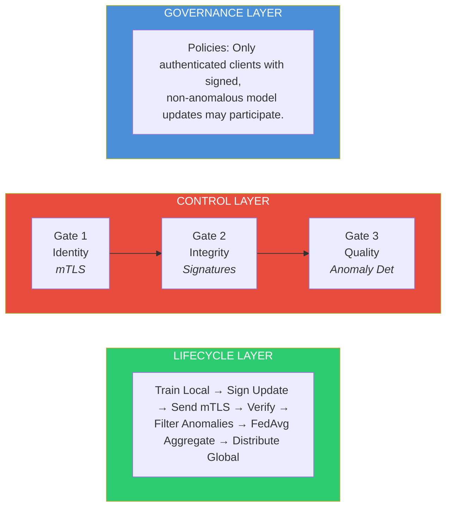

| Layer | Responsibility | Implementation |
|-------|---------------|----------------|
| **Governance** | Define participation rules and security policies | Encoded in strategy configuration and environment variables |
| **Control** | Enforce the policies through three sequential gates | `ZeroTrustFedAvg` strategy class in `server.py` |
| **Lifecycle** | Execute the FL training loop | Flower framework (`flwr`) client/server protocol |

### 4.2 System Topology

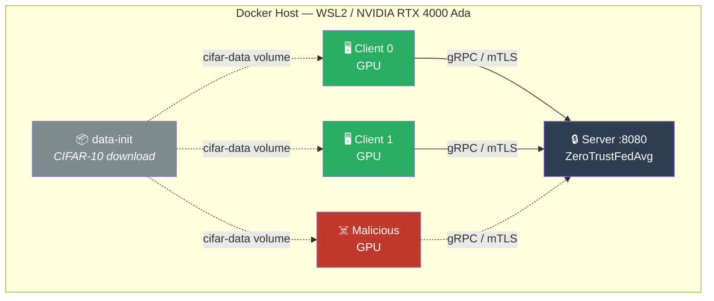

Additionally, the PKI infrastructure feeds trust material into the runtime containers:

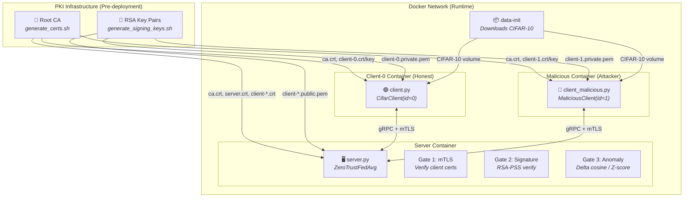

### 4.3 High-Level Data Flow

A single FL round proceeds as follows:

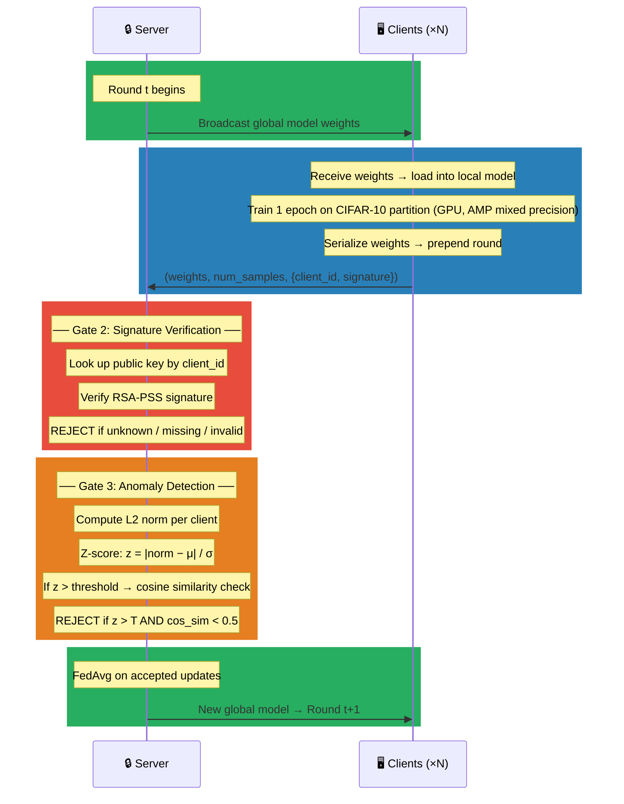

> **Note:** Gate 1 (mTLS) operates at the transport layer. Any client without a valid CA-signed certificate is rejected during the TLS handshake, _before_ any application-level data is exchanged.

### 4.4 Federated Round Lifecycle — Sequence Diagram

This diagram shows the full round lifecycle including the **malicious client's** journey through all three gates:

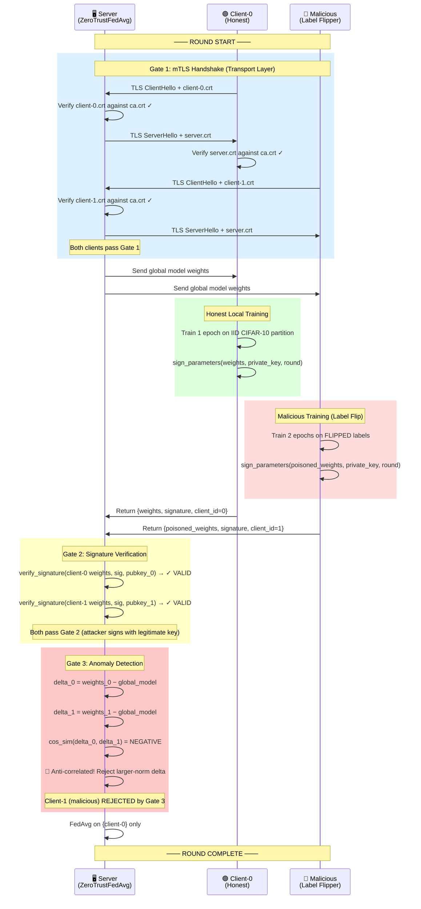

### 4.5 The Three-Gate Pipeline — Flowchart

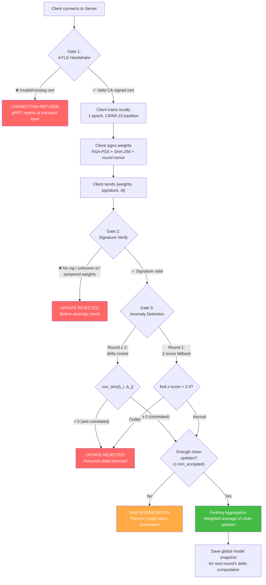

---

## 5. Technical Stack

| Component | Technology | Version | Purpose |
|-----------|-----------|---------|---------|
| OS | Windows 11 + WSL2 (Ubuntu 22.04) | — | Development environment |
| GPU | NVIDIA RTX 4000 Ada | — | Accelerated local training |
| Container Runtime | Docker + NVIDIA Container Toolkit | — | Simulate edge devices |
| FL Framework | Flower (`flwr`) | 1.13.1 | Client-server FL protocol, strategy customization |
| ML Framework | PyTorch | 2.5.1 (CUDA 12.4) | CNN model definition and training |
| Dataset | CIFAR-10 (via `torchvision`) | 0.20.1 | 60K 32×32 colour images, 10 classes |
| TLS Certificates | OpenSSL | System | PKI: Root CA, server cert, per-client certs |
| Digital Signatures | `cryptography` (Python) | ≥42.0.0 | RSA-PSS signing/verification with SHA-256 |
| gRPC | `grpcio` | ≥1.62.0 | Transport layer (Flower's communication backend) |
| Orchestration | Docker Compose | v2 | Multi-container service definition |

---

## 6. Project Structure

```
ZT-Pipeline/
│
├── model.py                  # CifarCNN – shared model definition
├── server.py                 # Flower server + ZeroTrustFedAvg strategy
├── client.py                 # Honest Flower client (train + sign + send)
├── client_malicious.py       # Adversarial client (label_flip / targeted / noise / scale)
├── signing.py                # RSA-PSS sign/verify utilities (replay-protected)
│
├── data_utils.py             # Shared CIFAR-10 loading and IID partitioning
├── training.py               # Shared training, evaluation, GPU config, hyperparams
├── mtls.py                   # Shared mTLS certificate loading and gRPC patching
│
├── generate_certs.sh         # OpenSSL PKI generation (mTLS certs)
├── generate_signing_keys.sh  # OpenSSL RSA key pair generation (signing)
│
├── Dockerfile                # CUDA 12.4 + PyTorch + Flower image
├── docker-compose.yml        # Orchestration: server + clients + attacker
├── requirements.txt          # Python dependencies
├── .gitignore                # Ignores certs/, signing_keys/, __pycache__/, etc.
│
├── certs/                    # Generated mTLS certificates (git-ignored)
│   ├── ca.crt / ca.key
│   ├── server.crt / server.key
│   ├── client-0.crt / client-0.key
│   └── client-1.crt / client-1.key
│
├── signing_keys/             # Generated RSA signing keys (git-ignored)
│   ├── client-0.private.pem / client-0.public.pem
│   └── client-1.private.pem / client-1.public.pem
│
├── baseline_experiment/      # Insecure control-group implementation
│   ├── baseline_server.py
│   ├── baseline_client.py
│   ├── baseline_malicious_client.py
│   ├── Dockerfile
│   ├── docker-compose-baseline.yml
│   └── docker-compose-baseline-attack.yml
│
└── ARCHITECTURE.md           # This document
```

### File Descriptions

| File | Lines | Description |
|------|-------|-------------|
| `model.py` | ~35 | `CifarCNN` — 3 conv layers + 2 FC layers. Input: 3×32×32, Output: 10 classes. Shared between server and clients to ensure parameter count consistency. |
| `server.py` | ~375 | Flower server entry point. Defines `ZeroTrustFedAvg(FedAvg)` strategy with `aggregate_fit()` implementing Gate 2 + Gate 3 + minimum-accepted quorum. **Deny-by-default**: crashes if mTLS certs are missing. Passes `server_round` to `verify_signature()` for replay protection. |
| `client.py` | ~140 | Flower client entry point. **Deny-by-default**: crashes without mTLS certs or signing key. Uses shared modules for training (AMP, TF32), mTLS, and data loading. Signs updates with round-bound replay nonce. |
| `client_malicious.py` | ~200 | Adversarial client supporting four attack modes: `label_flip`, `targeted`, `noise`, and `scale`. Holds valid mTLS cert and signing key — designed to pass Gates 1 & 2 but fail Gate 3 (delta-cosine / Z-score detection). |
| `signing.py` | ~185 | Utility module: deterministic weight serialization (`numpy.save`), SHA-256 pre-hashing, RSA-PSS sign/verify with **round-bound replay protection**, key I/O. Catches only `InvalidSignature` (not broad `Exception`). |
| `data_utils.py` | ~50 | Shared CIFAR-10 loading (`get_cifar10()`) and IID partitioning (`partition_data()`). Eliminates duplication across all client files. |
| `training.py` | ~130 | Shared GPU configuration (TF32, matmul precision), hyperparameters, `train_one_epoch()` with AMP, `evaluate()`, `get_parameters()`/`set_parameters()`, `create_model()` with `torch.compile`. |
| `mtls.py` | ~45 | Shared mTLS helpers: `load_client_certificates()` and `patch_grpc_for_mtls()`. Used by all ZT client files. |
| `generate_certs.sh` | ~90 | Bash/OpenSSL script: creates Root CA (4096-bit RSA), signs server + 2 client certificates with SAN extensions. |
| `generate_signing_keys.sh` | ~55 | Bash/OpenSSL script: generates PKCS#8 RSA-2048 key pairs for each client (default: 2). |

---

## 7. Governance Layer — Policy Definitions

The Governance Layer encodes the Zero-Trust policies that the Control Layer enforces. In this implementation, policies are defined declaratively through configuration:

| Policy | Rule | Enforcement | Config |
|--------|------|-------------|--------|
| **Authentication** | Only clients holding a certificate signed by the trusted Root CA may connect. **Deny-by-default:** server and clients crash if certs are missing. | Gate 1 (mTLS at gRPC layer) | `certs/ca.crt` used as trust anchor |
| **Authorization** | Only clients with a registered `client_id` (0 to `NUM_CLIENTS-1`) may participate | Gate 2 (public key lookup) | `NUM_CLIENTS` env var |
| **Integrity** | Every model update must carry a valid RSA-PSS signature **bound to the current round** (replay protection) | Gate 2 (signature verification) | `signing_keys/*.public.pem` |
| **Freshness** | Signatures include a 4-byte round nonce — replayed updates from a previous round fail verification | Gate 2 (round-bound signing) | Automatic via `on_fit_config_fn` |
| **Quality** | Updates with anomalous weight deltas (anti-correlated direction or Z-score outlier) are rejected | Gate 3 (statistical filtering) | `ANOMALY_Z_THRESHOLD` env var |
| **Minimum Participation Quorum** | A round only proceeds if `MIN_CLIENTS` clients participate | Flower strategy config | `MIN_CLIENTS` env var |
| **Minimum Accepted Quorum** | Aggregation only proceeds if at least `MIN_ACCEPTED` updates survive all gates — prevents single-client model domination | `ZeroTrustFedAvg` guard | `MIN_ACCEPTED` env var |
| **Least Privilege** | Server receives only public keys; each client mounts only its own private key | Docker volume mounts | `docker-compose.yml` |

---

## 8. Control Layer — The Zero-Trust Gates

### 8.1 Gate 1: Identity Verification (mTLS)

**Purpose:** Verify the identity of both the server and each client before any data is exchanged.

**Mechanism:** Mutual TLS (mTLS) over gRPC.

#### PKI Hierarchy

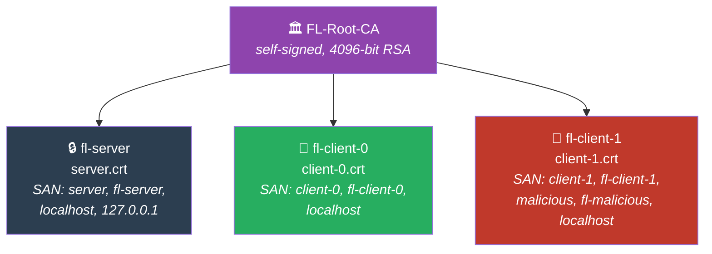

All certificates are:
- **4096-bit RSA** key pairs
- Signed by the Root CA
- Valid for **365 days**
- Include `extendedKeyUsage = serverAuth, clientAuth` (both roles)
- Include Subject Alternative Names for Docker DNS resolution

#### Server-Side Implementation

Flower's `start_server(certificates=...)` accepts a tuple `(ca_cert, server_cert, server_key)`. Internally, Flower creates:

```python
grpc.ssl_server_credentials(
    [(server_key, server_cert)],
    root_certificates=ca_cert,
    require_client_auth=True,   # ← Forces mutual authentication
)
```

Any client connecting without a valid CA-signed certificate receives a **TLS handshake failure** and is denied access.

> **Deny-by-default:** The server's `_load_certificates()` raises a `RuntimeError` if any certificate file is missing. The server **cannot** start in an insecure mode — this ensures that a misconfiguration never silently downgrades security.

#### Client-Side Implementation

Flower's `start_client(root_certificates=...)` only passes the CA certificate to `grpc.ssl_channel_credentials()`. For true **mutual** TLS, the client must also present its own certificate. This is achieved by monkey-patching `grpc.ssl_channel_credentials` at runtime to inject the client's cert and private key:

```python
def _patch_grpc_for_mtls(ca_cert, client_cert, client_key):
    _original = grpc.ssl_channel_credentials
    def _mtls(root_certificates=None, private_key=None, certificate_chain=None):
        return _original(
            root_certificates=root_certificates or ca_cert,
            private_key=client_key,
            certificate_chain=client_cert,
        )
    grpc.ssl_channel_credentials = _mtls
```

> **Deny-by-default:** If `_load_client_certificates()` returns `None` (files missing), `main()` raises a `RuntimeError` and the client **refuses to connect**. There is no insecure fallback.

#### Certificate Generation

```bash
bash generate_certs.sh
```

Produces the `certs/` directory with all certificates and keys.

---

### 8.2 Gate 2: Update Integrity (Digital Signatures)

**Purpose:** Ensure that the model weights received by the server are exactly what the client produced — no tampering in transit or at rest.

**Mechanism:** RSA-PSS signatures with SHA-256 pre-hashing.

#### Signing Protocol

**Client Side:**

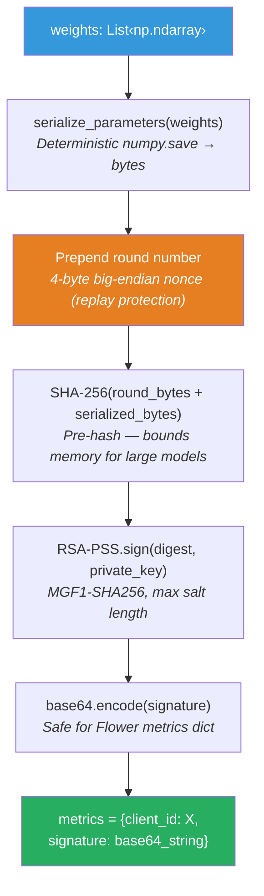

**Server Side:**

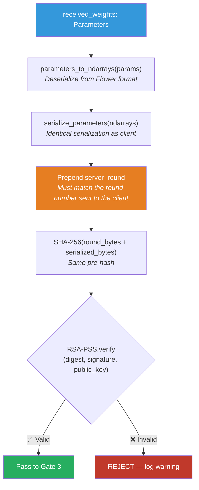

#### Replay Protection

The signature covers `round_number (4 bytes, big-endian) || serialized_weights`. The round number is forwarded to clients via Flower's `on_fit_config_fn` callback:

```python
on_fit_config_fn=lambda server_round: {"server_round": server_round}
```

The server re-derives the same prefix when verifying:

```python
verify_signature(ndarrays, sig, public_key, server_round=server_round)
```

This means a captured update from round $t$ cannot be replayed in round $t+1$ because the digest will differ.

#### Why RSA-PSS over PKCS#1 v1.5?

RSA-PSS (Probabilistic Signature Scheme) is the recommended padding mode for RSA signatures:
- **Provably secure** in the random oracle model (unlike PKCS#1 v1.5)
- **Randomized** — the same message produces different signatures each time, preventing signature analysis attacks
- Uses MGF1 (Mask Generation Function) with SHA-256 for additional security
- The modern recommendation from NIST SP 800-131A

#### Why Pre-Hashing?

Model weights can be large (hundreds of MB for production models). Pre-hashing with SHA-256 reduces the data fed into the RSA operation to a fixed 32 bytes, keeping memory consumption bounded regardless of model size.

#### Key Management (Least-Privilege)

The server and clients mount **only the keys they need**:

| Asset | Mounted Into | Access |
|-------|-------------|--------|
| `client-{id}.private.pem` | **Only** the corresponding client container | Read-only, single-file mount |
| `client-{id}.public.pem` | **Only** the server container | Read-only, per-file mount |

In `docker-compose.yml` this is enforced per-service:

```yaml
# Server — public keys only
server:
  volumes:
    - ./signing_keys/client-0.public.pem:/signing_keys/client-0.public.pem:ro
    - ./signing_keys/client-1.public.pem:/signing_keys/client-1.public.pem:ro

# Client 0 — its own private key only
client-0:
  volumes:
    - ./signing_keys/client-0.private.pem:/signing_keys/client-0.private.pem:ro
```

The client's `__init__()` raises a `RuntimeError` if the signing key is missing — an unsigned client cannot participate.

```bash
bash generate_signing_keys.sh
```

Produces 2048-bit RSA key pairs in PKCS#8 PEM format.

---

### 8.3 Gate 3: Aggregation Quality (Anomaly Detection)

**Purpose:** Detect and reject model updates that are statistically anomalous — even if they pass identity and integrity checks. This defends against **insider threats**: authenticated clients sending poisoned weights.

**Mechanism:** Two-tier detection — **delta-cosine similarity** (primary, rounds 2+) with **Z-score norm outlier** (fallback, round 1).

#### Algorithm

Gate 3 uses two strategies depending on whether the previous global model is available:

##### Primary Strategy: Delta-Cosine Similarity (rounds 2+)

Given the global model from the previous round $w^{t}_{global}$ and $n$ verified client updates $w_1, w_2, \ldots, w_n$:

**Step 1 — Compute update deltas:**

$$\Delta_i = w_i - w^{t}_{global}$$

**Step 2a — Two-client case ($n = 2$):**

Compute cosine similarity between the two deltas:

$$\cos(\theta) = \frac{\Delta_0 \cdot \Delta_1}{\|\Delta_0\|_2 \cdot \|\Delta_1\|_2}$$

- If $\cos(\theta) \geq 0$: **ACCEPT both** (correlated updates)
- If $\cos(\theta) < 0$: **REJECT the client with the larger delta norm** (anti-correlated → likely attacker)

**Step 2b — Multi-client case ($n \geq 3$):**

For each client $i$, compute mean cosine similarity against all others:

$$\overline{\cos}_i = \frac{1}{n-1} \sum_{j \neq i} \frac{\Delta_i \cdot \Delta_j}{\|\Delta_i\|_2 \cdot \|\Delta_j\|_2}$$

- If $\overline{\cos}_i \geq -0.1$: **ACCEPT**
- If $\overline{\cos}_i < -0.1$: **REJECT** (update direction is anti-correlated with the majority)

##### Fallback Strategy: Z-Score on L2 Norms (round 1 only)

On round 1, no previous global model exists for delta computation. The system falls back to:

**Step 1 — Compute L2 norms:**

$$\|w_i\|_2 = \sqrt{\sum_{j} w_{i,j}^2}$$

**Step 2 — Population statistics:**

$$\mu = \frac{1}{n} \sum_{i=1}^{n} \|w_i\|_2 \qquad \sigma = \sqrt{\frac{1}{n} \sum_{i=1}^{n} (\|w_i\|_2 - \mu)^2}$$

**Step 3 — Z-score for each client:**

$$z_i = \frac{|\|w_i\|_2 - \mu|}{\sigma}$$

**Step 4 — Decision:**

- If $z_i \leq T$ (threshold, default $T = 2.0$): **ACCEPT**
- If $z_i > T$: proceed to cross-check

**Step 5 — Cosine similarity cross-check** (for flagged outliers):

Compute the centroid of all _other_ clients' weights:

$$\bar{w}_{\neg i} = \frac{1}{n-1} \sum_{j \neq i} w_j$$

Then compute cosine similarity:

$$\cos(\theta) = \frac{w_i \cdot \bar{w}_{\neg i}}{\|w_i\|_2 \cdot \|\bar{w}_{\neg i}\|_2}$$

- If $\cos(\theta) > 0.5$: **ACCEPT with warning** (high norm but similar direction)
- If $\cos(\theta) \leq 0.5$: **REJECT — SECURITY ALERT**

##### Minimum Accepted Quorum

After Gate 3 filtering, the server enforces a **minimum accepted count** (`MIN_ACCEPTED`, default 2). If fewer updates survive:

> _"Only N update(s) survived the pipeline (minimum required: M) — skipping aggregation to prevent single-client model domination."_

This prevents an attacker from timing participation to isolate themselves as the sole survivor.

#### Why the Two-Stage Check?

The L2 norm alone can produce false positives when honest clients happen to have larger updates (e.g., from a harder data partition). The cosine similarity cross-check asks: _"Even if this update is large, is it pointing in the same direction as the others?"_ A legitimately larger update will still be directionally aligned; a poisoned one (random noise) will have near-zero cosine similarity with honest updates.

#### Configuration

| Environment Variable | Default | Description |
|---------------------|---------|-------------|
| `ANOMALY_Z_THRESHOLD` | `2.0` | Z-score cutoff. Lower = stricter filtering. |

---

## 9. Lifecycle Layer — The Federated Learning Loop

### 9.1 Model Architecture

The shared model is `CifarCNN` defined in `model.py`:

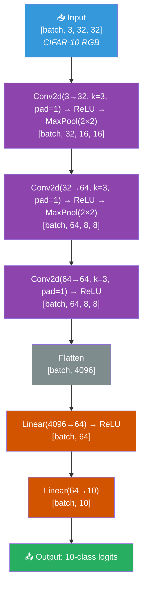

**Total parameters:** ~267,978

**Why this model?** It's deliberately simple. The thesis is about the *security pipeline*, not about achieving state-of-the-art accuracy. A 3-layer CNN on CIFAR-10:
- Trains in seconds per epoch on a GPU — enabling rapid experimental iteration.
- Has enough parameters (~270K) to make anomaly detection non-trivial (the L2 norm and cosine similarity operate over meaningful high-dimensional vectors).
- CIFAR-10's 10 classes make label-flip attacks intuitive: class $i \rightarrow$ class $9 - i$.

This architecture can be replaced with any PyTorch model without modifying the security infrastructure.

### 9.2 Data Partitioning

CIFAR-10 is partitioned using a simple **IID (Independent and Identically Distributed)** split:

- Total training samples: 50,000
- With $N$ clients, each receives $\lfloor 50000 / N \rfloor$ consecutive samples
- Test set (10,000 samples) is shared across all clients for evaluation

```python
def partition_data(train_set, num_clients, client_id):
    shard_size = len(train_set) // num_clients
    start = client_id * shard_size
    indices = list(range(start, start + shard_size))
    return Subset(train_set, indices)
```

### 9.3 Training Configuration

| Parameter | Value | Notes |
|-----------|-------|-------|
| Optimizer | Adam | $\text{lr} = 0.001$ |
| Loss | CrossEntropyLoss | Standard for classification |
| Local epochs per round | 1 | Keeps updates small for better convergence |
| Batch size | 64 | |
| FL rounds | 3 | Configurable in `ServerConfig` |
| Data normalization | CIFAR-10 channel means/stds | $(0.4914, 0.4822, 0.4465) / (0.2470, 0.2435, 0.2616)$ |
| Device | CUDA (auto-detect) | **Crashes** if required certs/keys are missing (no CPU/insecure fallback) |
| **Mixed Precision** | `torch.amp.autocast("cuda")` + `GradScaler` | FP16 on Tensor Cores; ~2× training throughput on RTX 4000 Ada |
| **TF32 Matmul** | `torch.backends.cuda.matmul.allow_tf32 = True` | Exploits Ampere+ TF32 format for 3× FP32-equivalent FLOPS |
| **Pinned Memory** | `pin_memory=True` on DataLoaders | Faster async CPU→GPU transfers via `non_blocking=True` |
| **Graph Compilation** | `torch.compile(model)` | PyTorch 2.x Inductor backend; fuses ops, reduces kernel launches |
| **Gradient zeroing** | `optimizer.zero_grad(set_to_none=True)` | Avoids memset; faster than default `zero_grad()` |
| **Weight loading** | `torch.from_numpy()` | Zero-copy from NumPy vs. `torch.tensor()` which copies data |

### 9.4 Aggregation Strategy

The aggregation strategy is `ZeroTrustFedAvg`, which extends Flower's built-in `FedAvg`:

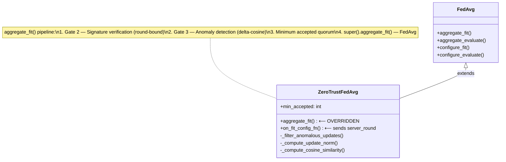

FedAvg computes the weighted average of client parameters:

$$w_{global}^{t+1} = \sum_{k=1}^{K} \frac{n_k}{\sum_{j=1}^{K} n_j} \cdot w_k^{t+1}$$

where $n_k$ is the number of training samples on client $k$ and $K$ is the number of accepted clients.

---

## 10. Component Deep Dive — The "Why" & "How"

This section goes beyond summarizing each file. It explains the **critical logic** — the specific design decisions that, when questioned by a professor, need a clear and defensible answer.

### 10.1 `generate_certs.sh` — The Foundation of Trust

**What it does:** Creates a complete Public Key Infrastructure (PKI) with a single Root Certificate Authority.

**Why it matters:** Without this, there is no Gate 1. The entire mTLS chain depends on every certificate being traceable to the same CA.

**Critical logic:**

```bash
openssl req -new -x509 \
    -key "${CERT_DIR}/ca.key" \
    -out "${CERT_DIR}/ca.crt" \
    -days 365 \
    -subj "/C=US/ST=Research/O=ZT-Pipeline/CN=FL-Root-CA"
```

This generates the **self-signed Root CA** — the ultimate trust anchor. Both the server and clients will validate each other's certificates by checking: *"Was this cert signed by a CA I trust?"*

**SAN (Subject Alternative Names) — the subtle but vital detail:**

```bash
generate_cert "server" "fl-server" \
    "DNS:server,DNS:fl-server,DNS:localhost,IP:127.0.0.1"
```

The `DNS:server` SAN entry matches the Docker Compose service name `server`. When clients connect to `server:8080`, gRPC validates the server certificate's SAN against the hostname. Without this, the TLS handshake fails with a hostname mismatch — a common deployment pitfall.

**Produced artifacts:**

| File | Held By | Purpose |
|---|---|---|
| `ca.crt` | Server + all clients | Trust anchor — "Who issued valid certs?" |
| `ca.key` | **Offline only** (not mounted) | CA signing key — never in containers |
| `server.crt` / `server.key` | Server | Server's identity proof |
| `client-{id}.crt` / `client-{id}.key` | Respective client only | Client identity proof |

> **Zero-Trust principle enforced:** The CA private key (`ca.key`) is deliberately *not* mounted into any Docker container. It exists only for the offline cert-generation step. If a container is compromised, the attacker cannot mint new certificates.

---

### 10.2 `generate_signing_keys.sh` — Gate 2 Key Material

**What it does:** Generates RSA-2048 key pairs for each client. Private keys stay with clients; public keys are shared with the server.

**Why separate from mTLS certs?** This is a *separation of concerns* design:

- **mTLS certificates** (Gate 1) prove *who you are* at the transport layer.
- **Signing keys** (Gate 2) prove *that you authored this specific model update* at the application layer.

Even if the TLS connection is somehow MitM'd or replayed (theoretical), the signature binds the exact bytes of the model update to the specific client key and round number. This is **defense-in-depth**: one compromised layer doesn't compromise the other.

---

### 10.3 `model.py` — The Neural Network

**Architecture:**

```
Input (3×32×32) → Conv(3→32)+ReLU+Pool → Conv(32→64)+ReLU+Pool
                → Conv(64→64)+ReLU → FC(4096→64)+ReLU → FC(64→10)
```

**The `forward()` flow** (lines 22–29):
1. `conv1` + `pool`: 32×32 → 16×16 feature maps (32 channels)
2. `conv2` + `pool`: 16×16 → 8×8 feature maps (64 channels)
3. `conv3` (no pool): preserves 8×8 spatial resolution for richer features
4. Flatten to 64×8×8 = 4096-dim vector
5. Two fully connected layers → 10-class logits

---

### 10.4 `signing.py` — The Cryptographic Core

This file implements both sides of Gate 2: **client-side signing** and **server-side verification**.

#### 10.4.1 Deterministic Serialization (`serialize_parameters`)

```python
def serialize_parameters(parameters: List[np.ndarray]) -> bytes:
    buf = io.BytesIO()
    for arr in parameters:
        np.save(buf, arr, allow_pickle=False)
    return buf.getvalue()
```

**Why this is critical:** Digital signatures operate on **bytes**. If the client and server serialize the same NumPy arrays differently (e.g., different byte order, different pickle protocol), the signature verification will *always* fail — even for honest clients. Using `numpy.save` with `allow_pickle=False` ensures:

- Deterministic byte output across machines (same NumPy version on both ends, guaranteed by Docker).
- No pickle deserialization attacks (an attacker can't embed executable code in a model update).

#### 10.4.2 Replay Protection — The Round Nonce

```python
data = server_round.to_bytes(4, "big") + data
```

**Why prepend the round number?** Without it, an attacker who intercepts a valid `(weights, signature)` pair from Round 1 could **replay** it in Round 5. The signature would still be valid because the bytes haven't changed.

By prepending the round number as a 4-byte big-endian integer:
- A Round 1 signature is **invalid** in Round 2 (the digest changes).
- The server passes `server_round` to `verify_signature`, so both sides agree on which round they're in.
- This is a lightweight nonce mechanism — no extra communication needed because Flower already distributes the round number in `config`.

#### 10.4.3 Pre-Hashing Strategy

```python
digest = hashlib.sha256(data).digest()    # _digest()
signature = private_key.sign(
    digest,
    padding.PSS(mgf=padding.MGF1(hashes.SHA256()), salt_length=padding.PSS.MAX_LENGTH),
    utils.Prehashed(hashes.SHA256()),
)
```

**Why pre-hash?** Model updates can be **megabytes** in size. RSA-PSS signing internally hashes the input, but some implementations buffer the entire message in memory before hashing. Pre-hashing with SHA-256 produces a fixed 32-byte digest, keeping memory bounded regardless of model size. The `Prehashed(SHA256())` flag tells the `cryptography` library that we've already hashed, so it won't double-hash.

---

### 10.5 `client.py` — The Honest Participant

#### 10.5.1 mTLS Certificate Loading (Lines 170–193)

```python
def _load_client_certificates(client_id: int):
    ca_cert_path     = CERT_DIR / "ca.crt"
    client_cert_path = CERT_DIR / f"client-{client_id}.crt"
    client_key_path  = CERT_DIR / f"client-{client_id}.key"
```

**Three files, three purposes:**

| File | Purpose |
|---|---|
| `ca.crt` | Client uses this to verify the *server's* certificate → prevents connecting to a rogue server |
| `client-{id}.crt` | Client presents this to the server → server verifies the client's identity |
| `client-{id}.key` | Client's TLS private key → proves it owns the certificate (never leaves the container) |

This is **mutual** TLS: *both* sides authenticate. Standard HTTPS only verifies the server. mTLS adds client verification — the fundamental Zero-Trust identity gate.

#### 10.5.2 The gRPC Monkey Patch (Lines 195–215)

```python
def _patch_grpc_for_mtls(ca_cert, client_cert, client_key):
    _original_fn = grpc.ssl_channel_credentials
    def _mtls_ssl_channel_credentials(root_certificates=None, private_key=None, certificate_chain=None):
        return _original_fn(
            root_certificates=root_certificates or ca_cert,
            private_key=client_key,
            certificate_chain=client_cert,
        )
    grpc.ssl_channel_credentials = _mtls_ssl_channel_credentials
```

**Why is a monkey patch needed?** Flower's `start_client()` internally calls `grpc.ssl_channel_credentials(root_certificates=ca_cert)` but **does not** pass `private_key` or `certificate_chain`. Without the client certificate, the TLS handshake succeeds (server identity verified) but the *server* cannot verify the *client* — mTLS is incomplete.

This patch intercepts the credential-creation call and injects the client's certificate and key. It's an implementation necessity due to Flower's API limitations in version 1.13.1, not an architectural choice.

> **Defense note:** If a professor asks "Why not use Flower's built-in mTLS?", the answer is: Flower's `start_client()` API provides `root_certificates` for server verification but lacks parameters for client certificate presentation. The monkey patch bridges this gap without forking the framework.

#### 10.5.3 Signing in `fit()` (Lines 143–156)

```python
def fit(self, parameters, config):
    self.set_parameters(parameters)
    loss = train_one_epoch(self.model, self.train_loader, self.scaler)
    updated_params = self.get_parameters(config={})

    server_round = int(config.get("server_round", 0))
    metrics: dict = {"client_id": float(self.client_id)}
    sig = sign_parameters(updated_params, self.signing_key, server_round=server_round)
    metrics["signature"] = sig
```

**The signing happens AFTER training, BEFORE transmission.** This is critical:
- The signature covers the *exact* weights being sent, not the pre-training weights.
- The `server_round` nonce is included → replay protection.
- The `client_id` is sent in metrics so the server knows *which* public key to use for verification.
- The signature is base64-encoded (safe for Flower's metrics dict, which uses Python dicts serialized over gRPC).

#### 10.5.4 GPU Optimizations

| Feature | Line | Purpose |
|---|---|---|
| TF32 precision | Lines 51–53 | Enables Tensor Float32 on Ampere+ GPUs (RTX 4000 Ada) — 2–3× speedup for matmul |
| `torch.compile` | Line 123 | PyTorch 2.x graph-mode compilation — reduces Python overhead |
| AMP mixed precision | `train_one_epoch()` | `torch.amp.autocast` + `GradScaler` — uses FP16 where safe, FP32 where needed |
| `pin_memory=True` | Line 131 | Pre-stages tensors in page-locked CPU memory for faster GPU transfers |
| `persistent_workers=True` | Line 132 | Keeps DataLoader worker processes alive across batches |

These are real production-grade optimizations, demonstrating that the security pipeline doesn't come "instead of" performance — it works alongside GPU-accelerated training.

#### 10.5.5 Deny-by-Default Error Handling

Both certificate and signing key loading follow a **fail-closed** pattern:

```python
if key_path.exists():
    self.signing_key = load_private_key(key_path)
else:
    raise RuntimeError(
        f"[Client {client_id}] ✗  FATAL: signing key not found at {key_path}. "
        f"Zero-Trust policy: unsigned clients MUST NOT participate."
    )
```

If either mTLS certs or signing keys are missing, the client **crashes immediately** rather than falling back to insecure mode. This is the Zero-Trust principle "deny by default" — there is no graceful degradation.

---

### 10.6 `server.py` — The Zero-Trust Aggregator

#### 10.6.1 `ZeroTrustFedAvg` Strategy (Lines 203–238)

This custom Flower strategy **extends** `FedAvg` and overrides `aggregate_fit()` to insert Gates 2 and 3 before aggregation.

```python
class ZeroTrustFedAvg(FedAvg):
    def __init__(self, public_keys, z_threshold=2.0, min_accepted=1, **kwargs):
        super().__init__(**kwargs)
        self.public_keys = public_keys       # {cid_str: RSA_public_key}
        self.z_threshold = z_threshold       # Gate 3 sensitivity
        self.min_accepted = min_accepted     # Minimum survivors for aggregation
        self._global_params = None           # Previous round's global model
```

**Key design decision:** `_global_params` stores the aggregated model from the previous round. This enables **delta computation** (`w_i - global`) in Gate 3. Without it, the server can only compare absolute weight norms (less discriminative).

#### 10.6.2 Gate 2 Implementation in `aggregate_fit()` (Lines 249–280)

```python
for client_proxy, fit_res in results:
    cid = str(int(metrics.get("client_id", -1)))
    sig = metrics.get("signature", "")

    if cid not in self.public_keys:           # Unknown client
        gate2_rejected += 1; continue
    if not sig:                                # Missing signature
        gate2_rejected += 1; continue

    ndarrays = parameters_to_ndarrays(fit_res.parameters)
    if verify_signature(ndarrays, sig, self.public_keys[cid], server_round=server_round):
        verified.append((cid, ndarrays, client_proxy, fit_res))
    else:
        gate2_rejected += 1                    # Tampered or wrong key
```

**Three rejection conditions — each maps to a Zero-Trust violation:**

| Condition | ZT Violation | Attack Scenario |
|---|---|---|
| `cid not in self.public_keys` | Unregistered identity | An unknown device joins the FL round |
| `not sig` | Missing integrity proof | A client tries to send weights without signing |
| `verify_signature() → False` | Tampered payload | MitM modified weights in transit, or key mismatch |

#### 10.6.3 Gate 3: Anomaly Detection — `_filter_anomalous_updates()` (Lines 100–195)

This is the most sophisticated security gate. It uses **three different strategies** depending on the situation:

**Strategy A — Directional Detection (2 clients, round ≥ 2):**

```python
deltas = [
    [u - g for u, g in zip(w, global_params)]
    for w in weights
]
cos_sim = _compute_cosine_similarity(deltas[0], deltas[1])
if cos_sim < 0.0:
    outlier_idx = int(np.argmax(norms))  # Reject the larger-norm delta
```

**The mathematical intuition:** Honest clients both train towards the same objective (minimize cross-entropy on correctly labeled data). Their weight *updates* (deltas) should point in roughly the same direction in parameter space — positive cosine similarity.

A label-flip attacker trains on *inverted* labels, producing a gradient in the **opposite** direction. The cosine similarity between an honest delta and a poisoned delta will be **negative** (anti-correlated).

When detected, the server rejects the client with the **larger delta norm** — the attacker typically has a larger update because they train for more epochs and/or the flipped labels produce larger gradients.

**Strategy B — Pairwise Cosine (≥ 3 clients, round ≥ 2):**

For 3+ clients, the server computes each client's **mean cosine similarity** against all others. Any client with mean cosine < −0.1 is rejected. This generalizes Strategy A to the multi-client setting and is robust against colluding attackers (unless they outnumber honest clients).

**Strategy C — Z-Score Fallback (Round 1, no global reference):**

In Round 1, there's no previous global model to compute deltas from. The server falls back to comparing **absolute L2 norms** of the raw weights. See [Section 8.3](#83-gate-3-aggregation-quality-anomaly-detection) for the full mathematical formulation.

#### 10.6.4 Minimum Acceptance Guard (Lines 320–330)

```python
if len(accepted) < self.min_accepted:
    log(WARNING, "[Zero-Trust] Only %d update(s) survived the pipeline "
        "(minimum required: %d) – skipping aggregation to prevent "
        "single-client model domination.", len(accepted), self.min_accepted)
    return None, {}
```

**Why this matters:** If Gate 3 rejects all but one client, aggregating that single client's update would give it **100% influence** over the global model. An adaptive attacker could exploit this by ensuring only their update survives. The minimum acceptance threshold prevents this — if too few updates survive, the round is skipped entirely.

With `MIN_ACCEPTED=2` (set in `docker-compose.yml`), the server requires at least 2 verified, non-anomalous updates to aggregate. This means the default experiment (1 honest + 1 malicious) will correctly reject the malicious client and then skip aggregation rather than let the lone honest client dominate.

#### 10.6.5 Global Model Snapshot Persistence (Lines 337–339)

```python
if agg_result is not None and agg_result[0] is not None:
    self._global_params = parameters_to_ndarrays(agg_result[0])
```

After successful aggregation, the new global model is saved. This is what enables Gate 3's delta-based detection in subsequent rounds — the server compares each client's new weights against this snapshot to compute the update direction.

#### 10.6.6 Server `main()` — The Startup Sequence

```python
def main():
    public_keys = load_client_public_keys(SIGNING_KEY_DIR, NUM_CLIENTS)  # Gate 2 setup
    strategy = ZeroTrustFedAvg(
        public_keys=public_keys,
        z_threshold=ANOMALY_Z_THRESHOLD,
        min_accepted=MIN_ACCEPTED,
        fraction_fit=1.0,            # All available clients participate
        min_fit_clients=MIN_CLIENTS, # Wait for this many before starting round
        on_fit_config_fn=lambda server_round: {"server_round": server_round},
    )
    certificates = _load_certificates()                                  # Gate 1 setup
    fl.server.start_server(
        server_address="0.0.0.0:8080",
        config=fl.server.ServerConfig(num_rounds=3),
        strategy=strategy,
        certificates=certificates,   # Enables mTLS on the gRPC server
    )
```

When `certificates` is passed to `start_server()`, Flower creates a gRPC server with **TLS enabled** and **client certificate required**. Any client without a valid CA-signed certificate is rejected at the transport layer — they never reach `aggregate_fit()`.

---

### 10.7 `client_malicious.py` — The Adversarial Proof

**Purpose in the thesis:** This file is *not* a vulnerability — it's a **controlled experiment** that proves Gate 3 is necessary.

#### 10.7.1 Label Flip Attack

```python
def _flip_labels_global(labels: torch.Tensor) -> torch.Tensor:
    return (NUM_CLASSES - 1) - labels   # class i → class (9 - i)
```

This creates a **mirror mapping**: 0↔9, 1↔8, 2↔7, etc. When the model trains on these flipped labels, it learns to predict the *opposite* class. The resulting gradient is anti-correlated with honest training.

#### 10.7.2 Why It Passes Gates 1 and 2

The malicious client:
- Has a **legitimate** mTLS certificate (`client-1.crt`) signed by the same CA → Gate 1 passes.
- Has a **legitimate** RSA private key (`client-1.private.pem`) → Gate 2 passes because the signature over the *poisoned* weights is mathematically correct.

This demonstrates the thesis's core argument: **identity and integrity alone are insufficient** for secure federated learning. A "trusted" participant can act maliciously.

#### 10.7.3 How Gate 3 Catches It

The server computes:

$$\cos(\Delta_{\text{honest}}, \Delta_{\text{malicious}}) < 0$$

Because the malicious delta points in the **opposite direction** to the honest one. This negative cosine similarity triggers the anomaly alert, and the malicious update is rejected.

---

### 10.8 Shared Modules — `data_utils.py`, `training.py`, `mtls.py`

These modules eliminate code duplication across the client files:

- **`data_utils.py`:** CIFAR-10 download/transform and IID partitioning — previously copy-pasted in every client.
- **`training.py`:** Device detection, GPU config (TF32, matmul precision), hyperparameters (`BATCH_SIZE`, `LEARNING_RATE`, `LOCAL_EPOCHS`), `train_one_epoch()` with AMP, `evaluate()` with autocast, `get_parameters()`/`set_parameters()`, `create_model()` with `torch.compile`, and `train_one_epoch_with_label_transform()` for attack modes.
- **`mtls.py`:** `load_client_certificates()` reads CA cert, client cert, and client key; `patch_grpc_for_mtls()` monkey-patches Flower's gRPC channel to inject TLS credentials.

> **Note on `poisoned_client.py` (removed):** The former `poisoned_client.py` (`noise` and `scale` attack modes) has been merged into `client_malicious.py`, which now supports all four attack modes: `label_flip`, `targeted`, `noise`, and `scale`. The `POISON_SCALE` env var (default `100.0`) controls the scale attack magnitude.

---

### 10.9 `Dockerfile` — Reproducible Environment

```dockerfile
FROM nvidia/cuda:12.4.1-cudnn-runtime-ubuntu22.04
```

**Why this base image?** The `cudnn-runtime` variant includes CUDA 12.4 and cuDNN 9.x libraries but **not** the compiler (`nvcc`). This keeps the image smaller while still enabling GPU-accelerated PyTorch inference and training.

```dockerfile
RUN pip install --no-cache-dir \
    torch==2.5.1 torchvision==0.20.1 \
    --index-url https://download.pytorch.org/whl/cu124
```

PyTorch is installed from the CUDA 12.4 wheel index to match the base image's CUDA version. Version pinning (`torch==2.5.1`) ensures reproducibility — a different PyTorch version could change tensor serialization (breaking Gate 2 signatures) or model behavior (breaking Gate 3 baselines).

**`PYTHONUNBUFFERED=1`** — Forces Python to flush stdout/stderr immediately, ensuring Docker logs show real-time gate status messages.

---

### 10.10 `docker-compose.yml` — Orchestration and Isolation

#### 10.10.1 Service Architecture

| Service | Role | Always On? |
|---|---|---|
| `data-init` | Downloads CIFAR-10 into shared volume | Runs once, then exits |
| `server` | Flower aggregation server | Yes |
| `client-0` | Honest participant | Yes |
| `malicious` | Label-flip attacker (CLIENT_ID=1) | Yes (default experiment) |
| `client-1` | Honest participant (replaces malicious) | Only in `clean` profile |

#### 10.10.2 The `data-init` Pattern

```yaml
data-init:
    command: >
      python -c "from torchvision import datasets, transforms;
      datasets.CIFAR10('/data', train=True,  download=True, ...);"
    volumes:
      - cifar-data:/data
```

**Why a separate container?** Without this, both clients would simultaneously try to download CIFAR-10 to the same shared volume, creating a race condition (half-written files, corruption, or duplicate downloads). The `data-init` container downloads once, and clients wait:

```yaml
depends_on:
    data-init:
        condition: service_completed_successfully
```

#### 10.10.3 Security-Critical Volume Mounting

```yaml
# Server gets ONLY public keys (read-only)
- ./signing_keys/client-0.public.pem:/signing_keys/client-0.public.pem:ro
- ./signing_keys/client-1.public.pem:/signing_keys/client-1.public.pem:ro

# Client-0 gets ONLY its own private key (read-only)
- ./signing_keys/client-0.private.pem:/signing_keys/client-0.private.pem:ro
```

**This enforces the Zero-Trust principle of least privilege:**
- The server **never** sees any client's private signing key.
- Client-0 **never** sees client-1's private key.
- All mounts are `:ro` (read-only) — even a compromised container can't modify certs/keys.
- The CA private key (`ca.key`) is **not mounted** anywhere — it's used offline only.

#### 10.10.4 Startup Timing

```yaml
client-0:
    command: sh -c "sleep 5 && python client.py"
malicious:
    command: sh -c "sleep 12 && python client_malicious.py"
```

The server needs time to start the gRPC listener before clients connect. Clients have staggered delays (5s and 12s) to ensure the server is ready. The malicious client has a longer delay because it needs more setup time (loading attack configuration).

#### 10.10.5 The `clean` Profile — Baseline Comparison

```yaml
client-1:
    profiles: ["clean"]
```

Running `docker compose --profile clean up server client-0 client-1` launches **two honest clients** instead of one honest + one malicious. This provides the baseline experiment: all updates should pass all three gates, and the model should converge normally. Useful for demonstrating that the security gates don't produce false positives on legitimate traffic.

---

## 11. Infrastructure & Deployment

### 11.1 Docker Image

**Base image:** `nvidia/cuda:12.4.1-cudnn-runtime-ubuntu22.04`

The Dockerfile builds a single image used by all services (server, clients, malicious client):

```dockerfile
FROM nvidia/cuda:12.4.1-cudnn-runtime-ubuntu22.04

# System deps → Python → PyTorch (CUDA 12.4 wheels) → Flower + cryptography
# Application code: model.py, server.py, client.py, client_malicious.py, signing.py
# Shared modules: data_utils.py, training.py, mtls.py
```

PyTorch is installed from the `cu124` index to match the CUDA runtime in the base image.

### 11.2 Docker Compose Orchestration

| Service | Container | Command | Profile | Purpose |
|---------|-----------|---------|---------|---------|
| `data-init` | `fl-data-init` | Download CIFAR-10 | default | Pre-download dataset into shared volume |
| `server` | `fl-server` | `python server.py` | default | FL aggregation server |
| `client-0` | `fl-client-0` | `python client.py` | default | Honest edge device 0 |
| `malicious` | `fl-malicious` | `python client_malicious.py` | default | Label-flip attacker (CLIENT_ID=1) — caught by Gate 3 |
| `client-1` | `fl-client-1` | `python client.py` | **clean** | Honest edge device 1 (baseline, replaces malicious) |

**Service dependencies:**
- `data-init` → must complete successfully before clients start
- `server` → must be started before clients attempt connection
- Clients have a 5-second sleep delay for server readiness

**Volumes (Least-Privilege Mounts):**

| Volume | Server mount | Client-0 mount | Client-1 / Malicious mount | Purpose |
|--------|-------------|----------------|---------------------------|--------|
| `cifar-data` | — | `/data` | `/data` | Shared CIFAR-10 dataset |
| `./certs` | `/certs:ro` | `/certs:ro` | `/certs:ro` | mTLS certificates (read-only) |
| `client-0.public.pem` | `/signing_keys/...:ro` | — | — | Server verifies client-0 |
| `client-1.public.pem` | `/signing_keys/...:ro` | — | — | Server verifies client-1 |
| `client-0.private.pem` | — | `/signing_keys/...:ro` | — | Client-0 signs updates |
| `client-1.private.pem` | — | — | `/signing_keys/...:ro` | Client-1 / Malicious signs updates |

### 11.3 GPU Passthrough

All services declare GPU access via Docker Compose deploy configuration:

```yaml
deploy:
  resources:
    reservations:
      devices:
        - driver: nvidia
          count: all
          capabilities: [gpu]
```

This requires the **NVIDIA Container Toolkit** installed in WSL2. Verify with:

```bash
docker run --rm --gpus all nvidia/cuda:12.4.1-cudnn-runtime-ubuntu22.04 nvidia-smi
```

---

## 12. Security Verification & Attack Simulation

### 12.1 Normal Operation

```powershell
cd D:\Z\Master\Code\Exp\ZT-Pipeline

# Generate cryptographic material
bash generate_certs.sh
bash generate_signing_keys.sh

# Build and run
docker compose build
docker compose up --abort-on-container-exit
```

**Expected behavior:**
- Gate 1: All clients establish mTLS connections (handshake succeeds)
- Gate 2: All updates are signed and verified (0 rejected)
- Gate 3: All norms are similar (0 anomalies detected)
- FedAvg proceeds normally across 3 rounds
- Accuracy improves from ~35% (round 1) to ~55% (round 3)

### 12.2 Attack Scenario — Label-Flip Poisoning

**Goal:** Demonstrate that a fully authenticated, properly signed client performing a label-flip attack is caught by Gate 3's delta-cosine detection.

```powershell
# Default experiment: 1 honest (client-0) + 1 malicious (label flip, CLIENT_ID=1)
docker compose up --abort-on-container-exit
```

**Expected behavior:**
- Gate 1: ✓ Malicious client has valid mTLS cert → **passes**
- Gate 2: ✓ Malicious client signs its poisoned weights → **passes**
- Gate 3: ✗ Cosine similarity of deltas is negative → **REJECTED**
  - Anti-correlated update direction detected
  - Client with larger delta norm rejected
  - Security alert logged
- FedAvg: With `MIN_ACCEPTED=2` and only 1 survivor, aggregation is **skipped** (single-client domination guard)

### 12.3 Attack Scenario — Swapped Signing Keys

**Goal:** Demonstrate that a client using another client's signing key is caught by Gate 2.

```powershell
# Swap client-0 and client-1 private keys
Copy-Item signing_keys\client-0.private.pem signing_keys\client-0.private.pem.bak
Copy-Item signing_keys\client-1.private.pem signing_keys\client-1.private.pem.bak
Copy-Item signing_keys\client-1.private.pem signing_keys\client-0.private.pem
Copy-Item signing_keys\client-0.private.pem.bak signing_keys\client-1.private.pem

# Run — both clients will be rejected
docker compose up --abort-on-container-exit

# Restore keys afterward
Copy-Item signing_keys\client-0.private.pem.bak signing_keys\client-0.private.pem -Force
Copy-Item signing_keys\client-1.private.pem.bak signing_keys\client-1.private.pem -Force
Remove-Item signing_keys\*.bak
```

**Expected behavior:**
- Gate 2: ✗ Client 0 signs with client-1's key → verification against client-0's public key fails → **REJECTED**
- Gate 2: ✗ Client 1 signs with client-0's key → same failure → **REJECTED**
- No aggregation occurs (0 verified updates)

### 12.4 Attack Scenario — Missing Certificate

**Goal:** Demonstrate that a client without a valid CA-signed certificate cannot connect at all.

```powershell
# Temporarily remove client-0's cert
Rename-Item certs\client-0.crt certs\client-0.crt.bak

# Run — client-0 will fail to connect
docker compose up --abort-on-container-exit

# Restore
Rename-Item certs\client-0.crt.bak certs\client-0.crt
```

**Expected behavior:**
- Gate 1: ✗ Client-0 cannot present a valid certificate → **the client process crashes with `RuntimeError`** (deny-by-default)
- Client-0 never attempts to connect to the server
- Only client-1 participates (if `MIN_CLIENTS=1`; otherwise the round stalls waiting for the missing client)

---

## 13. The "Zero Trust" Audit Trail

This section maps specific thesis claims to **exact code evidence** — designed for quick reference during a thesis defense.

### Claim 1: "The system verifies identity before any data exchange" (Gate 1)

| Evidence | Location |
|---|---|
| **Server loads CA cert + server cert for mTLS** | `server.py` → `_load_certificates()` lines 46–67 |
| **Server passes certificates to Flower, enabling TLS + client cert verification** | `server.py` → `main()`, line `fl.server.start_server(..., certificates=certificates)` |
| **Client fails fatally if certs are missing** | `client.py` → `main()`, line `raise RuntimeError(...)` |
| **Client patches gRPC to present its cert to server** | `client.py` → `_patch_grpc_for_mtls()` lines 195–215 |
| **Certificate chain traces to shared CA** | `generate_certs.sh` → `openssl x509 -req ... -CA ca.crt -CAkey ca.key` |
| **Each client cert is unique (CN=fl-client-{id})** | `generate_certs.sh` lines 87–93 |
| **Certs mounted read-only, private keys isolated per-container** | `docker-compose.yml` → volume mounts with `:ro` |

### Claim 2: "The system verifies the integrity of every model update" (Gate 2)

| Evidence | Location |
|---|---|
| **Client signs post-training weights with RSA-PSS** | `client.py` → `CifarClient.fit()`, line `sig = sign_parameters(...)` |
| **Signature includes round nonce (replay protection)** | `signing.py` → `sign_parameters()`, line `data = server_round.to_bytes(4, "big") + data` |
| **Server verifies signature before aggregation** | `server.py` → `ZeroTrustFedAvg.aggregate_fit()`, Gate 2 block |
| **Unknown client IDs are rejected** | `server.py` → `if cid not in self.public_keys` |
| **Missing signatures are rejected** | `server.py` → `if not sig` |
| **Tampered/wrong-key signatures are rejected** | `server.py` → `if verify_signature(...) → False` |
| **Verification uses identical serialization** | `signing.py` → same `serialize_parameters()` used for both sign and verify |
| **Key separation: server has ONLY public keys** | `docker-compose.yml` → server volumes mount only `*.public.pem` |
| **Client crashes if signing key is missing** | `client.py` → `raise RuntimeError("Zero-Trust policy: unsigned clients MUST NOT participate")` |

### Claim 3: "The system detects and rejects anomalous (poisoned) model updates" (Gate 3)

| Evidence | Location |
|---|---|
| **Delta-cosine detection for 2-client case** | `server.py` → `_filter_anomalous_updates()`, Strategy A (lines 140–165) |
| **Pairwise cosine for ≥3 clients** | `server.py` → `_filter_anomalous_updates()`, Strategy B (lines 168–183) |
| **Z-score fallback for Round 1** | `server.py` → `_filter_anomalous_updates()`, Strategy C (lines 186–210) |
| **Global model snapshot saved per round** | `server.py` → `ZeroTrustFedAvg.aggregate_fit()`, line `self._global_params = ...` |
| **Minimum acceptance guard prevents single-client domination** | `server.py` → `if len(accepted) < self.min_accepted` |
| **Configurable Z-score threshold via environment variable** | `server.py` → `ANOMALY_Z_THRESHOLD = float(os.environ.get(...))` |

### Claim 4: "Identity + integrity alone are insufficient; behavioral checks are required"

| Evidence | Location |
|---|---|
| **Malicious client holds valid mTLS certs** | `client_malicious.py` → `_load_client_certificates()` uses legitimate `client-1.crt` |
| **Malicious client signs poisoned weights with valid key** | `client_malicious.py` → `MaliciousClient.fit()`, `sign_parameters(poisoned_params, ...)` |
| **Attack produces anti-correlated deltas caught by cosine check** | `server.py` → `cos_sim < 0.0` triggers rejection |
| **docker-compose.yml default experiment = 1 honest + 1 malicious** | `docker-compose.yml` → `malicious` service is always-on |

### Claim 5: "The system follows defense-in-depth with layered security"

| Evidence | Location |
|---|---|
| **mTLS certs ≠ signing keys (separation of concerns)** | Separate generation scripts, separate volume mounts |
| **Gate 2 runs AFTER Gate 1 (connection layer → application layer)** | Sequence: mTLS handshake → Flower protocol → `aggregate_fit()` |
| **Gate 3 runs AFTER Gate 2 (integrity → behavior)** | `server.py` → `aggregate_fit()` code ordering |
| **Each gate is independently configurable** | Env vars: `CERT_DIR`, `SIGNING_KEY_DIR`, `ANOMALY_Z_THRESHOLD`, `MIN_ACCEPTED` |
| **Deny-by-default at every layer** | Fatal errors on missing certs, keys, or invalid signatures |

---

## 14. Configuration Reference

All configuration is injected via environment variables in `docker-compose.yml`:

| Variable | Used By | Default | Description |
|----------|---------|---------|-------------|
| `CERT_DIR` | server, clients | `/certs` | Path to mTLS certificate directory |
| `SIGNING_KEY_DIR` | server, clients | `/signing_keys` | Path to RSA signing key directory |
| `NUM_CLIENTS` | server, clients | `2` | Total number of registered clients (for key loading and data partitioning) |
| `MIN_CLIENTS` | server | `NUM_CLIENTS` | Minimum clients required per round to proceed |
| `MIN_ACCEPTED` | server | `2` | Minimum updates that must survive Gates 2+3 for aggregation to proceed |
| `ANOMALY_Z_THRESHOLD` | server | `2.0` | Z-score threshold for Gate 3 anomaly detection (round 1 fallback) |
| `CLIENT_ID` | clients | `0` | Numeric identifier for this client (0-indexed) |
| `SERVER_ADDRESS` | clients | `server:8080` | gRPC endpoint for the Flower server |
| `ATTACK_MODE` | `client_malicious.py` | `label_flip` | Attack strategy: `"label_flip"`, `"targeted"`, `"noise"`, or `"scale"` |
| `LOCAL_EPOCHS` | `client_malicious.py` | `2` | Attacker local training epochs per round |
| `SOURCE_LABEL` | `client_malicious.py` | `0` | Source class for targeted flip |
| `TARGET_LABEL` | `client_malicious.py` | `1` | Target class for targeted flip |
| `NOISE_SCALE` | `client_malicious.py` | `5.0` | Gaussian noise standard deviation (noise mode) |
| `POISON_SCALE` | `client_malicious.py` | `100.0` | Magnitude of the scale poisoning attack |

---

## 15. "Defense Q&A" Cheat Sheet

### Q1: "What happens if an attacker steals a client's private key (both TLS and signing)?"

**Answer based on the implementation:**

If an attacker obtains both `client-0.key` (mTLS) and `client-0.private.pem` (signing), they could impersonate Client-0 through Gates 1 and 2. However, the damage is **mitigated** by three factors in this codebase:

1. **Gate 3 still operates.** If the attacker sends poisoned updates while the real Client-0 is also participating, Gate 3 will detect the behavioral anomaly (the attacker's deltas won't correlate with other honest clients). If the attacker *replaces* Client-0 entirely, they must still produce updates that are directionally consistent with the honest majority to evade Gate 3.

2. **Blast radius is container-scoped.** Docker volume mounts ensure Client-0's private key is only inside Client-0's container (`docker-compose.yml` mounts individual PEM files, not the entire directory). Compromising one container doesn't expose other clients' keys.

3. **Replay protection via round nonce.** Even with a stolen key, an attacker can't replay a previously captured `(weights, signature)` pair — it's bound to a specific round number via `server_round.to_bytes(4, "big")` prepended before signing.

**What is NOT implemented (thesis limitation):** There is no **certificate revocation** mechanism (no CRL or OCSP). If a key is stolen, the only remediation is to regenerate the PKI. A production system would add:
- Short-lived certificates with automatic rotation.
- A Certificate Revocation List (CRL) checked by the server.
- Key rotation for signing keys (e.g., per-round ephemeral keys).

---

### Q2: "Your Gate 3 uses cosine similarity. Couldn't a sophisticated attacker craft an update that has positive cosine similarity with honest updates but still poisons the model?"

**Answer based on the implementation:**

Yes — this is a known limitation, and the code comments acknowledge it implicitly through the tiered detection strategy. A sophisticated attacker could perform a **small-angle attack**: nudge the model in a subtly wrong direction that maintains positive cosine similarity with honest updates but still degrades accuracy over many rounds.

The current implementation partly mitigates this through:

1. **Norm-aware rejection in the 2-client case** — even with positive cosine, if one client's delta norm is a statistical outlier (per the Z-score fallback in Round 1), it's flagged.

2. **The minimum acceptance guard** (`min_accepted=2`) — prevents a scenario where an adaptive attacker poisons just enough to get others rejected while surviving themselves.

3. **Three rounds** — the simulation runs 3 FL rounds, so an attacker's cumulative drift would need to be consistent across rounds (the global model snapshot updates after each successful aggregation, resetting the baseline).

**Honest answer for defense:** Gate 3 is a *statistical heuristic*, not a mathematical guarantee. The thesis should acknowledge that Byzantine-resilient aggregation is an active research area. The implementation demonstrates the *principle* of behavioral verification in a Zero-Trust pipeline. Stronger alternatives (e.g., Krum, Multi-Krum, RFA — Robust Federated Averaging) could replace `_filter_anomalous_updates()` as a drop-in upgrade.

---

### Q3: "Why not use Differential Privacy (DP) instead of — or in addition to — your anomaly detection for Gate 3?"

**Answer based on the implementation:**

The implementation does not include Differential Privacy, and here's why this is a deliberate scope decision:

1. **Different threat models.** DP protects *data privacy* (prevents the server from inferring a client's training data from their model updates). Gate 3 protects *model integrity* (prevents a malicious client from corrupting the global model). They address orthogonal concerns.

2. **DP can actually *help* attackers.** DP-FL adds calibrated noise to model updates before sending them. This noise can **mask** malicious updates by making all updates look noisier, reducing Gate 3's ability to distinguish honest from malicious. There's a known tension between privacy (DP) and robustness (Byzantine detection).

3. **The thesis's Zero-Trust focus.** The three gates implement the Zero-Trust triad: *verify identity* (Gate 1), *verify integrity* (Gate 2), *verify behavior* (Gate 3). DP would be a fourth, privacy-focused layer. The simulation scope is bounded to demonstrate the three-gate Zero-Trust architecture, not to solve all FL security problems simultaneously.

**If asked "Would you add DP in production?":** Yes. In a production deployment, each client could apply local DP (e.g., Gaussian noise with bounded sensitivity) *before* signing. The server's Gate 2 would verify the signature over the *noised* parameters (this works because the client signs what it sends), and Gate 3's thresholds would need recalibration to account for the elevated noise floor. Flower 1.x supports server-side DP via `DifferentialPrivacyServerSideAdaptiveClipping` strategy wrapper.

---

### Q4: "Why 3 rounds? Is that enough to demonstrate convergence?"

**Answer:** Three rounds is sufficient for this security-focused simulation because:

1. **The goal is demonstrating the security pipeline, not achieving SOTA accuracy.** The codebase is not benchmarking FL convergence — it's showing that Gates 1–3 correctly accept/reject updates.

2. **Gate 3's delta-cosine detection activates from Round 2** (Round 1 uses the Z-score fallback because there's no previous global model). Three rounds means we see: one fallback round + two directional detection rounds.

3. **Practical GPU time.** Each round involves every client training a CNN epoch on CIFAR-10. Even with GPU acceleration, more rounds would significantly increase experiment runtime without adding security insight.

---

### Q5: "How does the system handle a new client joining mid-training?"

**Answer:** In the current implementation, it **doesn't** — and this is by design:

- `NUM_CLIENTS` is fixed at startup via environment variable.
- The server pre-loads exactly `NUM_CLIENTS` public signing keys.
- mTLS certificates must be pre-generated by `generate_certs.sh`.

A new client would need: (a) a CA-signed TLS certificate, (b) an RSA signing key pair with the public key deployed to the server, and (c) the server restarted with an updated `NUM_CLIENTS`. This is a Zero-Trust design choice: **no client can join without explicit pre-authorization**. Dynamic enrollment would require a registration authority component (a future extension).

---

## 16. Limitations & Future Work

### Current Limitations

| Limitation | Description | Mitigation Path |
|-----------|-------------|----------------|
| **Single-machine simulation** | All containers share one GPU; does not test real network latency or bandwidth constraints | Deploy to a multi-node Kubernetes cluster with actual edge devices |
| **IID data partition** | Real-world FL data is typically non-IID, which affects both convergence and anomaly detection | Implement Dirichlet-based non-IID partitioning |
| **Static PKI** | Certificates and signing keys are generated once and mounted statically; no revocation mechanism | Implement certificate rotation and an OCSP/CRL revocation mechanism |
| **Self-reported client_id** | Gate 1 (mTLS CN) and Gate 2 (`client_id` in metrics) are not cross-referenced; a client could claim a different ID | Extract CN from mTLS peer certificate at the gRPC interceptor level and enforce binding with the self-reported `client_id` |
| **Monkey-patched gRPC** | Client mTLS is achieved by monkey-patching `grpc.ssl_channel_credentials` — fragile and thread-unsafe | Upstream contribution to Flower or use a custom gRPC transport layer; Flower 1.14+ may expose direct mTLS config |
| **No differential privacy** | Model updates may still leak information about the training data | Add DP-SGD (e.g., `opacus` library) for $(\varepsilon, \delta)$-differential privacy |
| **No audit logging** | Security events are printed to stdout but not persisted | Integrate structured logging (JSON) with a SIEM or ELK stack |
| **2048-bit signing keys** | NIST recommends ≥3072-bit RSA for protection beyond 2030 | Upgrade `generate_signing_keys.sh` to 3072-bit or migrate to Ed25519 |

### Future Work Extensions

1. **Identity Binding (Gate 1 ↔ Gate 2):** Extract the mTLS Common Name from the gRPC peer certificate and enforce that it matches the self-reported `client_id`. This closes the last identity-spoofing vector.

2. **Certificate Revocation:** Implement OCSP stapling or a CRL distribution point so compromised clients can be revoked mid-training.

3. **Byzantine-Robust Aggregation:** Replace FedAvg with Krum or Trimmed Mean for provably robust aggregation under $f < n/3$ Byzantine clients.

4. **Differential Privacy:** Add calibrated Gaussian noise to local updates before signing, providing formal privacy guarantees.

5. **Secure Aggregation:** Use additive secret sharing (e.g., CKKS homomorphic encryption) so the server can aggregate without seeing individual updates.

6. **Continuous Monitoring Dashboard:** Build a Grafana dashboard consuming structured logs from the pipeline, visualizing per-round: norms, cosine similarities, acceptance rates, accuracy trends.

7. **Non-IID Partition Experiments:** Test Gate 3's false positive rate under varying levels of data heterogeneity (Dirichlet $\alpha = 0.1, 0.5, 1.0$).

8. **Model-Agnostic Design:** Validate the pipeline with larger models (ResNet-18, EfficientNet) and different datasets (FEMNIST, Shakespeare) to confirm that the security gates generalize.

9. **Stronger Signing Keys:** Migrate from 2048-bit RSA to 3072-bit RSA or Ed25519 for post-2030 compliance per NIST SP 800-57.

---

> _This is the unified architecture and code guide for the ZT-Pipeline project. It combines
> the formal architecture documentation with the code-level logic explanations, audit trail,
> and defense preparation material into a single reference document._
